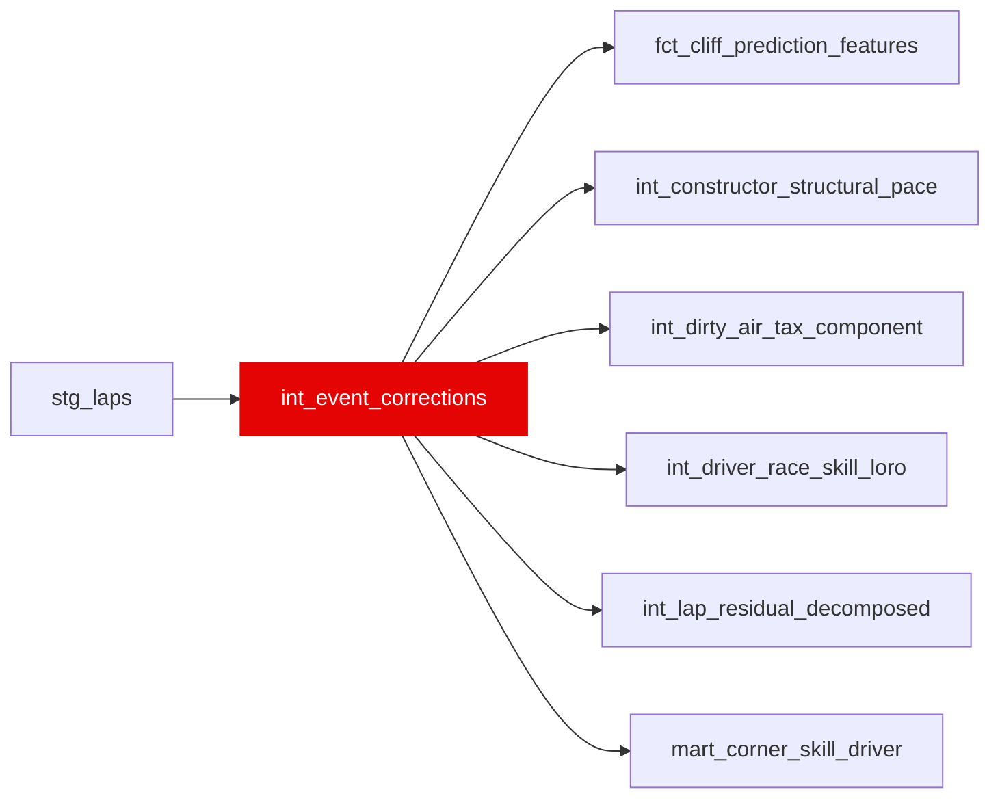

{/* _AUTOGENERATED   do not hand-edit. Run `python scripts/gen_dbt_reference.py` to regenerate. */}

<Note>Part of the [Residual](/transform/families/residual) family.</Note>

Safety car, red flag, and other race event corrections. One row per lap with event flags indicating whether the lap should be treated as anomalous for skill extraction (e.g., SC restart, red flag laps).

## Lineage

## Overview

| Property | Value |
|---|---|
| Layer | `intermediate` |
| Family | [Residual](/transform/families/residual) |
| Contract enforced | No |
| Upstream | [`stg_laps`](../stg/stg_laps) |

**2 tests** [guard](/transform/ci/overview) this model  -  2 generic, 0 singular.

## Columns

| Column | Type | Nullable | Tests | Description |
|---|---|---|---|---|
| `lap_id` |   | Yes | [`not_null`](/transform/ci/structural), [`unique`](/transform/ci/structural) | Foreign key to stg_laps |
