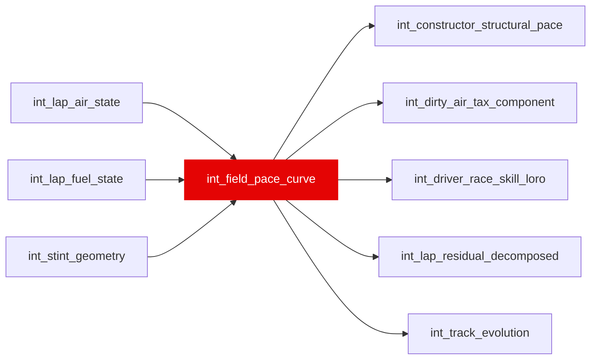

{/* _AUTOGENERATED   do not hand-edit. Run `python scripts/gen_dbt_reference.py` to regenerate. */}

<Note>Part of the [Pace Baselines](/transform/families/pace-baselines) family.</Note>

Field-level baseline pace curve. Grain is (race_year, race_id, lap_number). Computes rolling median of free-air pace for each lap to establish a clean baseline uncontaminated by individual driver skill or traffic.

## Lineage

## Overview

| Property | Value |
|---|---|
| Layer | `intermediate` |
| Family | [Pace Baselines](/transform/families/pace-baselines) |
| Contract enforced | No |
| Upstream | [`int_lap_fuel_state`](./int_lap_fuel_state), [`int_stint_geometry`](./int_stint_geometry), [`int_lap_air_state`](./int_lap_air_state) |

**5 tests** [guard](/transform/ci/overview) this model  -  3 generic, 2 singular.

## Columns

| Column | Type | Nullable | Tests | Description |
|---|---|---|---|---|
| `race_year` |   | Yes | [`not_null`](/transform/ci/structural) | Race year |
| `race_id` |   | Yes | [`not_null`](/transform/ci/structural) | Race identifier |
| `lap_number` |   | Yes | [`not_null`](/transform/ci/structural) | Lap number within race |
