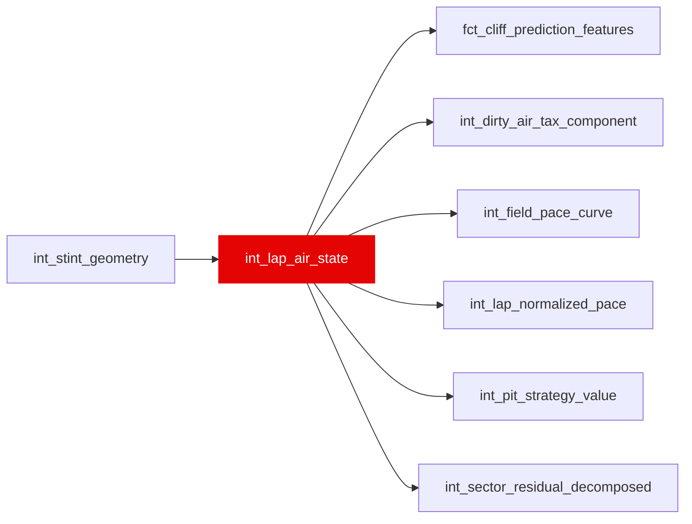

{/* _AUTOGENERATED   do not hand-edit. Run `python scripts/gen_dbt_reference.py` to regenerate. */}

<Note>Part of the [Physics](/transform/families/physics) family.</Note>

Air state classification and thermal load from dirty air. One row per stint-lap. Classifies air state per sector (free_air, tow_zone, drs_train, dirty_air) and accumulates cumulative thermal load on tyre surface and bulk using exponential moving average.

## Lineage

## Overview

| Property | Value |
|---|---|
| Layer | `intermediate` |
| Family | [Physics](/transform/families/physics) |
| Contract enforced | No |
| Upstream | [`int_stint_geometry`](./int_stint_geometry) |

**6 tests** [guard](/transform/ci/overview) this model  -  4 generic, 2 singular.

## Columns

| Column | Type | Nullable | Tests | Description |
|---|---|---|---|---|
| `lap_id` |   | Yes | [`not_null`](/transform/ci/structural), [`unique`](/transform/ci/structural) | Foreign key to stg_laps |
| `time_in_dirty_air_s` |   | Yes | [`not_null`](/transform/ci/structural), [`expect_column_values_to_be_between`](/transform/ci/range-and-domain) | Real per-lap dirty-air exposure time (seconds), summed from actual ~10Hz telemetry sample durations where gap-to-car-ahead &lt; 1.5s. Zeroed on SC/VSC laps (no real aero load at safety-car speeds). Null-gap samples (~5%, car ahead unavailable) are treated as free air, matching dirty_air_share_lap's existing convention. |
