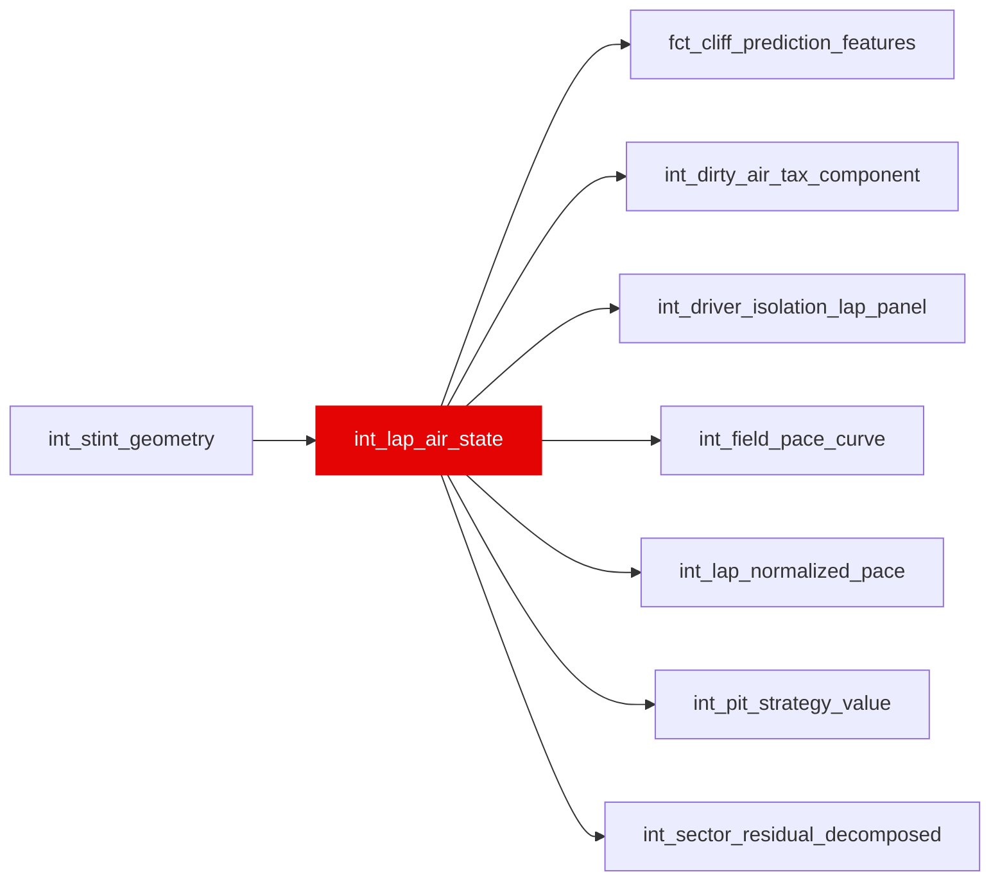

{/* _AUTOGENERATED   do not hand-edit. Run `python scripts/gen_dbt_reference.py` to regenerate. */}

<Note>Part of the [Physics](/transform/families/physics) family.</Note>

Air state classification and thermal load from dirty air. One row per stint-lap. Classifies air state per sector (free_air, tow_zone, drs_train, dirty_air) and accumulates cumulative thermal load on tyre surface and bulk using exponential moving average. S2 (the dirty-air third) is classified on the median gap alone: &lt; 1.5 s is dirty_air whatever DRS did (F48, WI-15a). drs_train and tow_zone arise only on the straight thirds (S1/S3), where DRS still splits a sub-1 s follow.

## Lineage

```mermaid
flowchart LR
  int_stint_geometry --> int_lap_air_state
  int_lap_air_state --> fct_cliff_prediction_features
  int_lap_air_state --> int_dirty_air_tax_component
  int_lap_air_state --> int_driver_isolation_lap_panel
  int_lap_air_state --> int_field_pace_curve
  int_lap_air_state --> int_lap_normalized_pace
  int_lap_air_state --> int_pit_strategy_value
  int_lap_air_state --> int_sector_residual_decomposed
  style int_lap_air_state fill:#e40404,stroke:#e40404,color:#fff
```

## Overview

| Property | Value |
|---|---|
| Layer | `intermediate` |
| Family | [Physics](/transform/families/physics) |
| Contract enforced | No |
| Upstream | [`int_stint_geometry`](./int_stint_geometry) |

**9 tests** [guard](/transform/ci/overview) this model  -  5 generic, 4 singular.

## Columns

| Column | Type | Nullable | Tests | Description |
|---|---|---|---|---|
| `lap_id` |   | Yes | [`not_null`](/transform/ci/structural), [`unique`](/transform/ci/structural) | Foreign key to stg_laps |
| `dirty_air_share_lap` |   | Yes |   | 1.0 when the lap's S2 median gap to the car ahead is under 1.5 s, else 0.0 (one S2 per lap, so it is a bit, not a fraction). Zeroed on SC/VSC/red-flag laps. Non-increasing in s2_gap_median_s by construction since F48 (WI-15a): before it, a sub-1 s S2 gap with DRS open was coded drs_train and billed 0 while 1.0-1.5 s was billed 1. Asserted by assert_dirty_air_share_monotone (T38). A contract feature, and lagged one lap it is the treatment in int_dirty_air_tax_component's theta_air, so it moves the label. |
| `s2_gap_median_s` |   | Yes | [`expect_column_values_to_be_between`](/transform/ci/range-and-domain) | F48 (WI-15a). The measured S2 median gap to the car ahead (seconds; DistanceToDriverAhead / point speed, median over the third's samples), i.e. the quantity dirty_air_share_lap is a function of. Raw: not zeroed on SC/VSC laps. NULL when the lap has no S2 gap sample. Not in the ML contract. |
| `s2_drs_active` |   | Yes |   | F48 (WI-15a). TRUE when any S2 sample had DRS open (FastF1 codes 10/12/14). This used to be folded into the S2 classification (it turned a sub-1 s dirty-air lap into a clean one); it is carried here instead, so the unsettled physics question (do DRS-open S2 laps lose less aero load?) stays answerable without the label assuming an answer. NULL when the lap has no S2 telemetry. Not in the ML contract. |
| `time_in_dirty_air_s` |   | Yes | [`not_null`](/transform/ci/structural), [`expect_column_values_to_be_between`](/transform/ci/range-and-domain) | Real per-lap dirty-air exposure time (seconds), summed from actual ~10Hz telemetry sample durations where gap-to-car-ahead &lt; 1.5s. Zeroed on SC/VSC laps (no real aero load at safety-car speeds). Null-gap samples (~5%, car ahead unavailable) are treated as free air, matching dirty_air_share_lap's existing convention. |
