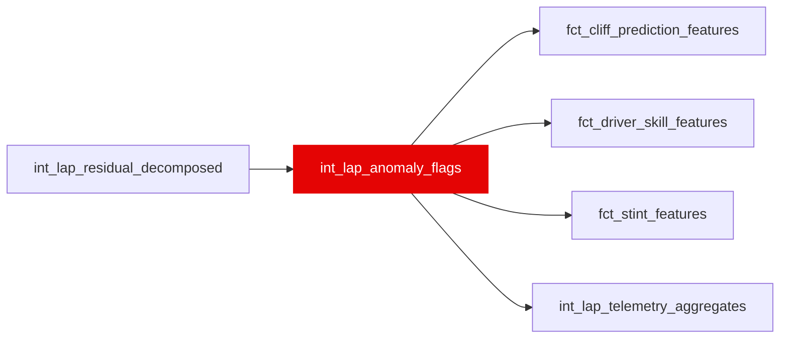

{/* _AUTOGENERATED   do not hand-edit. Run `python scripts/gen_dbt_reference.py` to regenerate. */}

<Note>Part of the [Residual](/transform/families/residual) family.</Note>

Anomaly detection flags for data quality control. One row per lap. Uses trailing-7-lap MAD (median absolute deviation) to classify anomalies robustly (cliff, mistakes, event-driven, conditions, normal).

## Lineage

## Overview

| Property | Value |
|---|---|
| Layer | `intermediate` |
| Family | [Residual](/transform/families/residual) |
| Contract enforced | No |
| Upstream | [`int_lap_residual_decomposed`](./int_lap_residual_decomposed) |

**3 tests** [guard](/transform/ci/overview) this model  -  2 generic, 1 singular.

## Columns

| Column | Type | Nullable | Tests | Description |
|---|---|---|---|---|
| `lap_id` |   | Yes | [`not_null`](/transform/ci/structural), [`unique`](/transform/ci/structural) | Foreign key to stg_laps |
