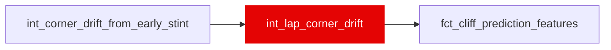

{/* _AUTOGENERATED   do not hand-edit. Run `python scripts/gen_dbt_reference.py` to regenerate. */}

<Note>Part of the [Residual](/transform/families/residual) family.</Note>

Item 02h. int_corner_drift_from_early_stint aggregated from (lap x corner) grain to lap grain -- the same mean/sd/max-per-phase shape int_lap_corner_inputs (02c) uses, applied to DRIFT instead of PACE. One row per race lap that has at least one corner row in the upstream model.
COVERAGE IS TWO CONFOUNDS AT ONCE, named so it is not mistaken for one. A lap's drift can be NULL because its own corner telemetry / field baseline is unmapped (02c's confound), OR because the lap sits inside the baseline window or its stint is shorter than 7 valid laps (a new, purely mechanical confound: a function of lap_in_stint / age_in_stint, both already in the 32-column contract). corner_drift_coverage is admitted as its own column, same reasoning as 02c's corner_input_coverage, and ablated separately as this item's arm C.

## Lineage

## Overview

| Property | Value |
|---|---|
| Layer | `intermediate` |
| Family | [Residual](/transform/families/residual) |
| Contract enforced | No |
| Tags | `feature_engineering` |
| Upstream | [`int_corner_drift_from_early_stint`](./int_corner_drift_from_early_stint) |

**8 tests** [guard](/transform/ci/overview) this model  -  8 generic, 0 singular.

## Columns

| Column | Type | Nullable | Tests | Description |
|---|---|---|---|---|
| `lap_id` |   | Yes | [`not_null`](/transform/ci/structural), [`unique`](/transform/ci/structural) | PK, FK to stg_laps. |
| `corners_total_n` |   | Yes | [`not_null`](/transform/ci/structural) | Corners the lineage placed on this lap. |
| `corners_drift_mapped_n` |   | Yes | [`not_null`](/transform/ci/structural) | Corners on this lap with at least one non-NULL phase drift value. |
| `corner_drift_coverage` |   | Yes | [`not_null`](/transform/ci/structural) | corners_drift_mapped_n / corners_total_n. The contract column -- see model description. |
| `corner_braking_drift_n` |   | Yes | [`not_null`](/transform/ci/structural) | Corners on this lap with a measured braking drift. Companion column, not a feature. |
| `corner_mid_drift_n` |   | Yes | [`not_null`](/transform/ci/structural) | Corners on this lap with a measured mid-corner drift. Companion column, not a feature. |
| `corner_exit_drift_n` |   | Yes | [`not_null`](/transform/ci/structural) | Corners on this lap with a measured exit drift. Companion column, not a feature. |
| `corner_braking_drift_mean_s` |   | Yes |   | Mean braking_drift_s across the lap's corners. Positive = braking has drifted earlier (worse) than the driver's own early-stint baseline. |
| `corner_braking_drift_sd_s` |   | Yes |   | Sample sd of braking_drift_s across the lap's corners. |
| `corner_braking_drift_max_s` |   | Yes |   | Largest braking_drift_s on the lap. |
| `corner_mid_drift_mean_s` |   | Yes |   | Mean mid_drift_s across the lap's corners. Positive = apex speed has drifted down from the driver's own early-stint baseline. |
| `corner_mid_drift_sd_s` |   | Yes |   | Sample sd of mid_drift_s across the lap's corners. |
| `corner_mid_drift_max_s` |   | Yes |   | Largest mid_drift_s on the lap. |
| `corner_exit_drift_mean_s` |   | Yes |   | Mean exit_drift_s across the lap's corners. Positive = throttle application has drifted later than the driver's own early-stint baseline. |
| `corner_exit_drift_sd_s` |   | Yes |   | Sample sd of exit_drift_s across the lap's corners. |
| `corner_exit_drift_max_s` |   | Yes |   | Largest exit_drift_s on the lap. |
