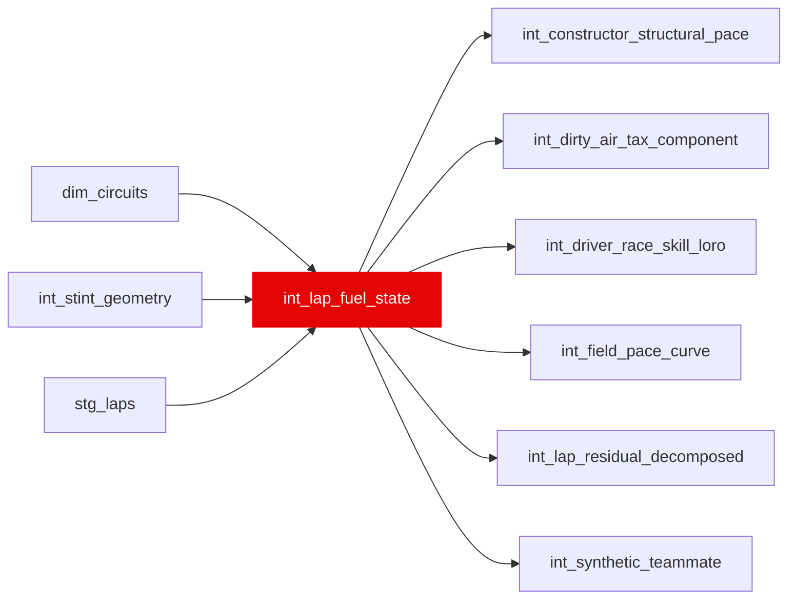

{/* _AUTOGENERATED   do not hand-edit. Run `python scripts/gen_dbt_reference.py` to regenerate. */}

<Note>Part of the [Physics](/transform/families/physics) family.</Note>

Fuel burnoff and weight correction. One row per valid lap. Calculates fuel_mass_kg based on consumption rate and weight_corrected_lap_time by applying weight penalty from fuel load.

## Lineage

## Overview

| Property | Value |
|---|---|
| Layer | `intermediate` |
| Family | [Physics](/transform/families/physics) |
| Contract enforced | No |
| Upstream | [`int_stint_geometry`](./int_stint_geometry), [`stg_laps`](../stg/stg_laps), [`dim_circuits`](../dim/dim_circuits) |

**3 tests** [guard](/transform/ci/overview) this model  -  2 generic, 1 singular.

## Columns

| Column | Type | Nullable | Tests | Description |
|---|---|---|---|---|
| `lap_id` |   | Yes | [`not_null`](/transform/ci/structural), [`unique`](/transform/ci/structural) | Foreign key to stg_laps |
