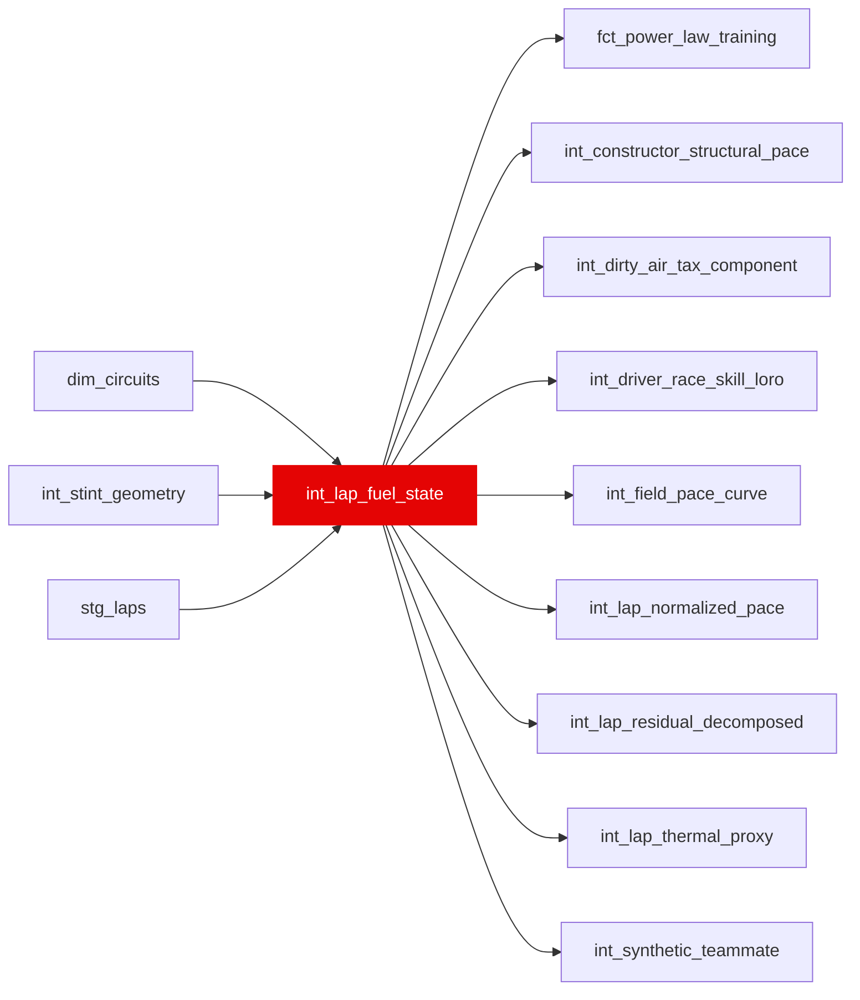

{/* _AUTOGENERATED   do not hand-edit. Run `python scripts/gen_dbt_reference.py` to regenerate. */}

<Note>Part of the [Physics](/transform/families/physics) family.</Note>

Fuel burnoff and weight correction. One row per valid lap. Calculates fuel_mass_kg based on consumption rate and weight_corrected_lap_time by applying weight penalty from fuel load. WI-05 (F6, F32, F52): the load is priced from the race's SCHEDULED distance (race_scheduled_laps seed) at the season's FIA race-fuel limit (105 kg 2018, 110 kg from 2019), burned evenly over the scheduled laps. It no longer aggregates over the race's own laps, so the aggregation-scope exemption this model used to carry (MAX(lap_number) over valid laps as a proxy for the scheduled distance) is gone with the aggregation.

## Lineage

```mermaid
flowchart LR
  dim_circuits --> int_lap_fuel_state
  int_stint_geometry --> int_lap_fuel_state
  stg_laps --> int_lap_fuel_state
  int_lap_fuel_state --> fct_power_law_training
  int_lap_fuel_state --> int_constructor_structural_pace
  int_lap_fuel_state --> int_dirty_air_tax_component
  int_lap_fuel_state --> int_driver_race_skill_loro
  int_lap_fuel_state --> int_field_pace_curve
  int_lap_fuel_state --> int_lap_normalized_pace
  int_lap_fuel_state --> int_lap_residual_decomposed
  int_lap_fuel_state --> int_lap_thermal_proxy
  int_lap_fuel_state --> int_synthetic_teammate
  style int_lap_fuel_state fill:#e40404,stroke:#e40404,color:#fff
```

## Overview

| Property | Value |
|---|---|
| Layer | `intermediate` |
| Family | [Physics](/transform/families/physics) |
| Contract enforced | No |
| Upstream | [`int_stint_geometry`](./int_stint_geometry), [`stg_laps`](../stg/stg_laps), [`dim_circuits`](../dim/dim_circuits) |

**11 tests** [guard](/transform/ci/overview) this model  -  5 generic, 6 singular.

## Columns

| Column | Type | Nullable | Tests | Description |
|---|---|---|---|---|
| `lap_id` |   | Yes | [`not_null`](/transform/ci/structural), [`unique`](/transform/ci/structural) | Foreign key to stg_laps |
| `race_lap_count` |   | Yes | [`not_null`](/transform/ci/structural) | The race's scheduled distance in laps (race_scheduled_laps.scheduled_laps), a pre-race known. |
| `initial_fuel_kg` |   | Yes | [`not_null`](/transform/ci/structural) | Starting race fuel = the season's FIA limit (macro fuel_regulatory_max_kg). |
| `fuel_consumption_rate_kg_per_lap` |   | Yes | [`not_null`](/transform/ci/structural) | initial_fuel_kg / race_lap_count -- the limit burned evenly over the scheduled distance. |
