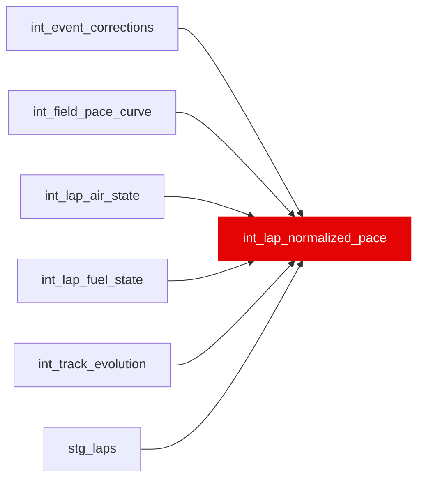

{/* _AUTOGENERATED   do not hand-edit. Run `python scripts/gen_dbt_reference.py` to regenerate. */}

<Note>Part of the [Physics](/transform/families/physics) family.</Note>

Phase C: lap pace with the dirty-air cost removed, so laps run in traffic stay usable for wear/cliff fitting instead of being discarded. normalized_pace_s = lap_time_s - theta_time * time_in_dirty_air_s, with theta_time calibrated on clean, dry, valid laps and applied to the full lap sequence. Neither a tow term nor a fixed in-traffic step is applied; both were measured against the phase's acceptance metric and made it worse (see the model header for the numbers). One row per lap carried by int_lap_air_state. Deliberately a graph leaf, consumed only by the offline cliff solver: feeding normalized pace into the ratings/residual chain would double-count the dirty-air component already modelled in int_lap_residual_decomposed.

## Lineage

## Overview

| Property | Value |
|---|---|
| Layer | `intermediate` |
| Family | [Physics](/transform/families/physics) |
| Contract enforced | No |
| Tags | `causal_decomposition`, `dirty_air` |
| Upstream | [`int_lap_air_state`](./int_lap_air_state), [`stg_laps`](../stg/stg_laps), [`int_lap_fuel_state`](./int_lap_fuel_state), [`int_field_pace_curve`](./int_field_pace_curve), [`int_event_corrections`](./int_event_corrections), [`int_track_evolution`](./int_track_evolution) |

**6 tests** [guard](/transform/ci/overview) this model  -  6 generic, 0 singular.

## Columns

| Column | Type | Nullable | Tests | Description |
|---|---|---|---|---|
| `lap_id` |   | Yes | [`not_null`](/transform/ci/structural), [`unique`](/transform/ci/structural) | Foreign key to stg_laps |
| `normalized_pace_s` |   | Yes | [`expect_column_values_to_be_between`](/transform/ci/range-and-domain), [`expect_column_values_to_be_between`](/transform/ci/range-and-domain) | Lap time net of the dirty-air penalty. Null only where lap_time_s itself is null (untimed lap); the solver filters those out rather than having a pace fabricated for them. |
| `dirty_air_penalty_s` |   | Yes | [`not_null`](/transform/ci/structural), [`expect_column_values_to_be_between`](/transform/ci/range-and-domain) | theta_time * time_in_dirty_air_s, bounded [0, 5.0] (same clamp as int_dirty_air_tax_component's dirty_air_tax_s). Zero on clean-air laps by construction. |
