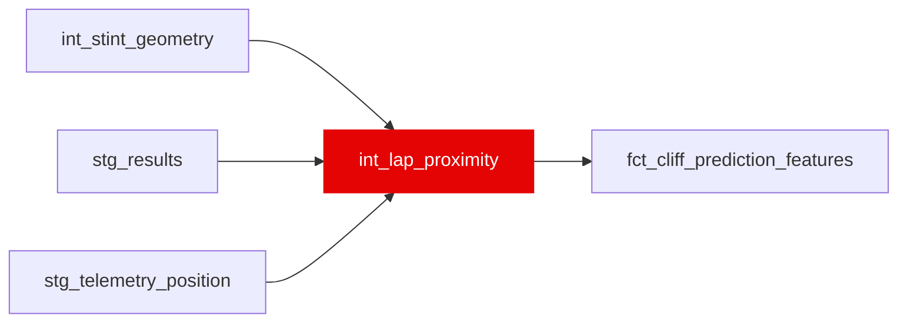

{/* _AUTOGENERATED   do not hand-edit. Run `python scripts/gen_dbt_reference.py` to regenerate. */}

<Note>Part of the [Physics](/transform/families/physics) family.</Note>

Phase 10a. True pairwise track gaps from the POSITION channel, reduced to per-lap scalars. One row per race lap, on the same spine as int_lap_air_state (162,729 rows, verified equal 2026-09-05).
This is the first feature family in the project built from a different sensor rather than from a further transform of the car channel or of lap times. Every incumbent traffic signal descends from FastF1's DistanceToDriverAhead, which int_lap_air_state divides by point speed to get a gap in seconds - a conversion that assumes the car ahead is travelling at the same speed as the car behind, which is exactly false in the situation the feature exists to describe. This model measures the time directly: each lap is cut into 100 fractions of relative_distance, the session clock at which each driver first enters each fraction is a crossing time of a fixed point on track, and the gap is the difference between two crossings of the same point. It needs no speed assumption and it is correct for lapped traffic.
Validated against the FIA's own blue flags, which are not derived from telemetry - see assert_proximity_agrees_with_blue_flags.

## Lineage

## Overview

| Property | Value |
|---|---|
| Layer | `intermediate` |
| Family | [Physics](/transform/families/physics) |
| Contract enforced | No |
| Upstream | [`stg_telemetry_position`](../stg/stg_telemetry_position), [`stg_results`](../stg/stg_results), [`int_stint_geometry`](./int_stint_geometry) |

**11 tests** [guard](/transform/ci/overview) this model  -  9 generic, 2 singular.

## Columns

| Column | Type | Nullable | Tests | Description |
|---|---|---|---|---|
| `lap_id` |   | Yes | [`not_null`](/transform/ci/structural), [`unique`](/transform/ci/structural) | Foreign key to stg_laps |
| `proximity_bin_count` |   | Yes | [`expect_column_values_to_be_between`](/transform/ci/range-and-domain) | How many of the 100 track bins this driver-lap produced a crossing for. Mean 99.8. NULL on the 1.22% of laps with no position telemetry (1,982 of 162,729) - left NULL rather than zeroed so "no data" stays distinguishable from "no traffic". |
| `gap_ahead_min_s` |   | Yes | [`expect_column_values_to_be_between`](/transform/ci/range-and-domain) | Closest the car ahead on track came, this lap (seconds). NULL when no other car crossed any of this lap's bins between this driver's own consecutive crossings, i.e. a full lap of clear air. Median 0.92 s. |
| `share_lap_within_1s` |   | Yes | [`not_null`](/transform/ci/structural), [`expect_column_values_to_be_between`](/transform/ci/range-and-domain) | Share of the lap's track bins with a car within 1 s ahead. Mean 0.2011. Zeroed on SC/VSC/red-flag laps for the same reason int_lap_air_state zeroes its dirty-air terms - the field bunches at a pace that generates no aero load. |
| `share_lap_in_train` |   | Yes | [`not_null`](/transform/ci/structural), [`expect_column_values_to_be_between`](/transform/ci/range-and-domain) | Share of the lap in a train rather than a single tow: this car within 1 s of the car ahead AND that car within 1 s of the car ahead of it. Mean 0.0800. Must never exceed share_lap_within_1s, which is its own first conjunct - asserted by assert_proximity_train_subset_of_within1s. |
| `ahead_identity_stability` |   | Yes | [`expect_column_values_to_be_between`](/transform/ci/range-and-domain) | Of the lap's bins that had a car within 3 s ahead, the share held by the single most frequent car. 1.0 = one car held the whole lap (a settled follow); low = the car ahead rotated (traffic being passed, or being lapped). Mean 0.9271. 31.0% NULL overall, stable at 28.6–32.2% per season. NULL semantics: only 1,449 of 36,044 nulls represent "no car ahead" (free air). The remaining 34,595 nulls mean the statistic is UNDEFINED — the proximity calculation cannot settle on a single car ahead, which happens on disrupted/bunched laps (SC/VSC/red flag). Do not treat NULL as zero or as "free air". A later consumer must condition on this distinction. |
| `ff_ahead_identity_agreement` |   | Yes |   | Diagnostic, never a feature. Share of the lap's bins where FastF1's own DriverAhead names the same car this model derives. 0.8704 across all seasons. Kept at lap grain so the incumbent and the new measure can be compared rather than one asserted better (Phase 10a: "run the ablation against both"). Where they disagree, FastF1's own DistanceToDriverAhead is roughly twice as large, i.e. it is naming a car further away than the one actually ahead on track. |
