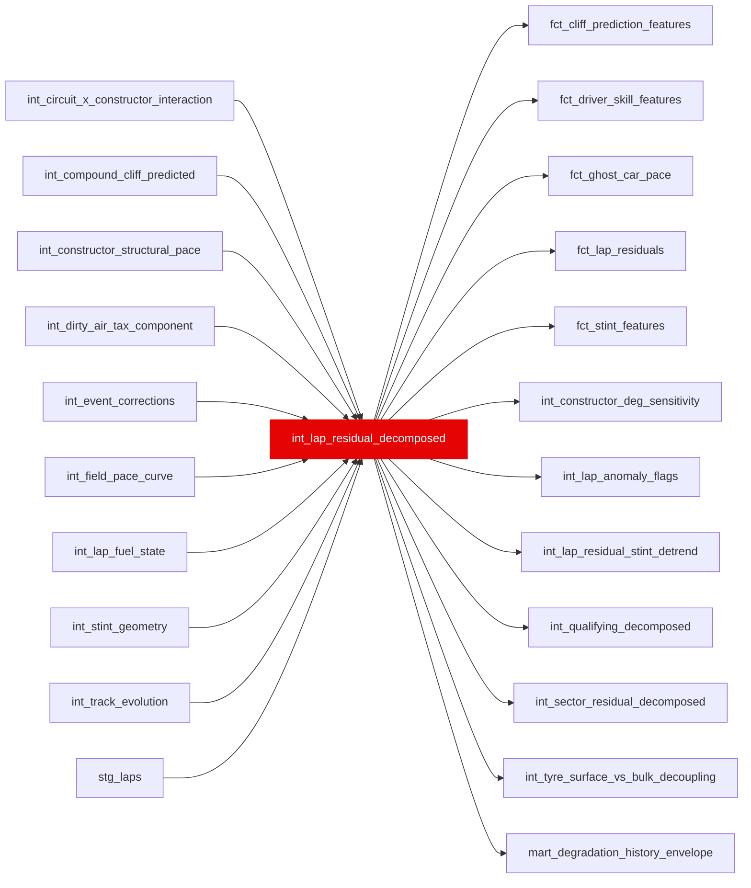

{/* _AUTOGENERATED   do not hand-edit. Run `python scripts/gen_dbt_reference.py` to regenerate. */}

<Note>Part of the [Residual](/transform/families/residual) family.</Note>

> For the conceptual foundation, read [Int Lap Residual Decomposed](/decomposition/seven-term-identity).

One row per lap. 7-term decomposition: splits lap time into fuel penalty, compound degradation, track rubber evolution, ambient weather, constructor car pace, dirty-air tax, and driver skill residual. Identity: pace_delta_s = fuel_component_s + compound_component_s + rubber_component_s + ambient_component_s + constructor_component_s + dirty_air_tax_s + driver_skill_residual_s. Driver skill residual = what remains after removing all physics/car/strategy factors.

## Lineage

## Overview

| Property | Value |
|---|---|
| Layer | `intermediate` |
| Family | [Residual](/transform/families/residual) |
| Contract enforced | No |
| Upstream | [`int_field_pace_curve`](./int_field_pace_curve), [`int_lap_fuel_state`](./int_lap_fuel_state), [`int_stint_geometry`](./int_stint_geometry), [`stg_laps`](../stg/stg_laps), [`int_compound_cliff_predicted`](./int_compound_cliff_predicted), [`int_track_evolution`](./int_track_evolution), [`int_constructor_structural_pace`](./int_constructor_structural_pace), [`int_circuit_x_constructor_interaction`](./int_circuit_x_constructor_interaction), [`int_dirty_air_tax_component`](./int_dirty_air_tax_component), [`int_event_corrections`](./int_event_corrections) |

**10 tests** [guard](/transform/ci/overview) this model  -  7 generic, 3 singular.

## Columns

| Column | Type | Nullable | Tests | Description |
|---|---|---|---|---|
| `lap_id` |   | Yes | [`not_null`](/transform/ci/structural), [`unique`](/transform/ci/structural) | Foreign key to stg_laps |
| `constructor_component_s` |   | Yes | [`not_null`](/transform/ci/structural) | Constructor structural pace in seconds from int_constructor_structural_pace. Positive = slower than field. |
| `dirty_air_tax_s` |   | Yes | [`not_null`](/transform/ci/structural), [`expect_column_values_to_be_between`](/transform/ci/range-and-domain) | Per-lap dirty-air slowdown cost from int_dirty_air_tax_component. Non-negative seconds. Zero when not in dirty air. |
| `driver_skill_residual_s` |   | Yes | [`not_null`](/transform/ci/structural) | Residual after all 7 physics components. Cleaned of dirty-air signal vs pre-causal-decomposition. Positive = slower than field baseline after all adjustments. |
| `total_explained_s` |   | Yes | [`not_null`](/transform/ci/structural) | Sum of all 7 components (fuel + compound + rubber + ambient + constructor + dirty_air_tax) |
