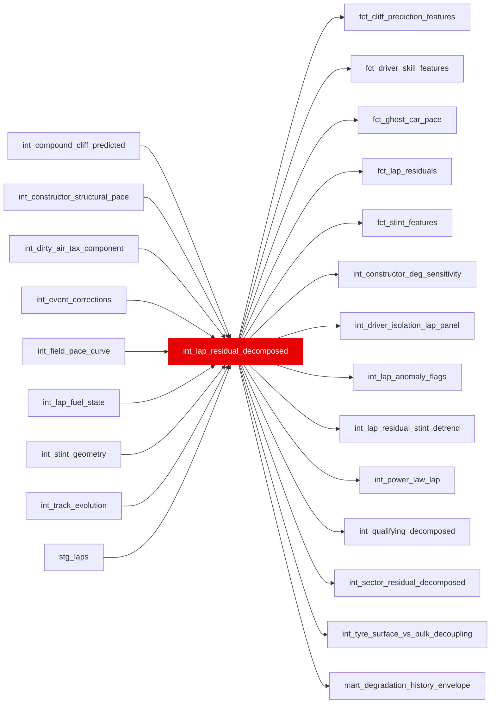

{/* _AUTOGENERATED   do not hand-edit. Run `python scripts/gen_dbt_reference.py` to regenerate. */}

<Note>Part of the [Residual](/transform/families/residual) family.</Note>

> For the conceptual foundation, read [Int Lap Residual Decomposed](/decomposition/seven-term-identity).

One row per lap. WI-01 (2026-09-27, Option A): base_track_pace_s is fuel- AND compound-neutral and already contains rubber/ambient (int_track_evolution decomposes that same base), so this model's identity is 5-term, not 7: pace_delta_s = fuel_component_s + compound_component_s + constructor_component_s + dirty_air_tax_s + driver_skill_residual_s. rubber_component_s and ambient_component_s are carried as informational columns only (F22 -- subtracting them again on top of the base would double-count them). Driver skill residual = what remains after removing fuel/compound/car/dirty-air. NULL (not a fabricated number) wherever base_track_pace_s or compound_component_s is itself unmeasured (F1).

## Lineage

```mermaid
flowchart LR
  int_compound_cliff_predicted --> int_lap_residual_decomposed
  int_constructor_structural_pace --> int_lap_residual_decomposed
  int_dirty_air_tax_component --> int_lap_residual_decomposed
  int_event_corrections --> int_lap_residual_decomposed
  int_field_pace_curve --> int_lap_residual_decomposed
  int_lap_fuel_state --> int_lap_residual_decomposed
  int_stint_geometry --> int_lap_residual_decomposed
  int_track_evolution --> int_lap_residual_decomposed
  stg_laps --> int_lap_residual_decomposed
  int_lap_residual_decomposed --> fct_cliff_prediction_features
  int_lap_residual_decomposed --> fct_driver_skill_features
  int_lap_residual_decomposed --> fct_ghost_car_pace
  int_lap_residual_decomposed --> fct_lap_residuals
  int_lap_residual_decomposed --> fct_stint_features
  int_lap_residual_decomposed --> int_constructor_deg_sensitivity
  int_lap_residual_decomposed --> int_driver_isolation_lap_panel
  int_lap_residual_decomposed --> int_lap_anomaly_flags
  int_lap_residual_decomposed --> int_lap_residual_stint_detrend
  int_lap_residual_decomposed --> int_power_law_lap
  int_lap_residual_decomposed --> int_qualifying_decomposed
  int_lap_residual_decomposed --> int_sector_residual_decomposed
  int_lap_residual_decomposed --> int_tyre_surface_vs_bulk_decoupling
  int_lap_residual_decomposed --> mart_degradation_history_envelope
  style int_lap_residual_decomposed fill:#e40404,stroke:#e40404,color:#fff
```

## Overview

| Property | Value |
|---|---|
| Layer | `intermediate` |
| Family | [Residual](/transform/families/residual) |
| Contract enforced | No |
| Upstream | [`int_field_pace_curve`](./int_field_pace_curve), [`int_lap_fuel_state`](./int_lap_fuel_state), [`int_stint_geometry`](./int_stint_geometry), [`stg_laps`](../stg/stg_laps), [`int_compound_cliff_predicted`](./int_compound_cliff_predicted), [`int_track_evolution`](./int_track_evolution), [`int_constructor_structural_pace`](./int_constructor_structural_pace), [`int_dirty_air_tax_component`](./int_dirty_air_tax_component), [`int_event_corrections`](./int_event_corrections) |

**22 tests** [guard](/transform/ci/overview) this model  -  7 generic, 15 singular.

## Columns

| Column | Type | Nullable | Tests | Description |
|---|---|---|---|---|
| `lap_id` |   | Yes | [`not_null`](/transform/ci/structural), [`unique`](/transform/ci/structural) | Foreign key to stg_laps |
| `valid_lap_in_stint` |   | Yes |   | Passed through from int_stint_geometry. Ordinal among valid laps only within the stint; consumers should key position/length logic off this, not lap_in_stint. |
| `stint_length_valid` |   | Yes |   | Passed through from int_stint_geometry. Count of valid laps in the stint. |
| `constructor_component_s` |   | Yes | [`not_null`](/transform/ci/structural) | Constructor structural pace in seconds from int_constructor_structural_pace. Positive = slower than field. |
| `dirty_air_tax_s` |   | Yes | [`not_null`](/transform/ci/structural), [`expect_column_values_to_be_between`](/transform/ci/range-and-domain) | Per-lap dirty-air slowdown cost from int_dirty_air_tax_component. Non-negative seconds. Zero when not in dirty air. Subtracted into driver_skill_residual_s, so θ_air sits inside the ML label: this column feeds DEGRADATION_TARGET and CLIFF_TARGET. 08q (2026-09-21) moved θ_air from an unfitted 0.5 literal to the fitted +0.1310 s/lap; the WI-01 label bump moved it to 0.5033 (interim) and W40 to the declared 0.331 s/lap. Each move changes this component on every dirty-air lap and requires a target rebuild plus a model version bump. |
| `driver_skill_residual_s` |   | Yes | [`not_null`](/transform/ci/structural) | Residual after fuel/compound/constructor/dirty-air (rubber and ambient are already inside base_track_pace_s, WI-01/F22, and are not subtracted again here). Positive = slower than field baseline after all adjustments. WI-01/F1: NULL, not a COALESCE-defaulted number, when base_track_pace_s (no measured field curve row) or compound_component_s (unknown tyre age, F39) is itself unmeasured -- see the model's header comment. |
| `total_explained_s` |   | Yes | [`not_null`](/transform/ci/structural) | Sum of fuel + compound + constructor + dirty_air_tax (rubber/ambient are already inside base_track_pace_s, WI-01/F22, and are informational columns only, not part of this sum). NULL under the same conditions as driver_skill_residual_s. |
