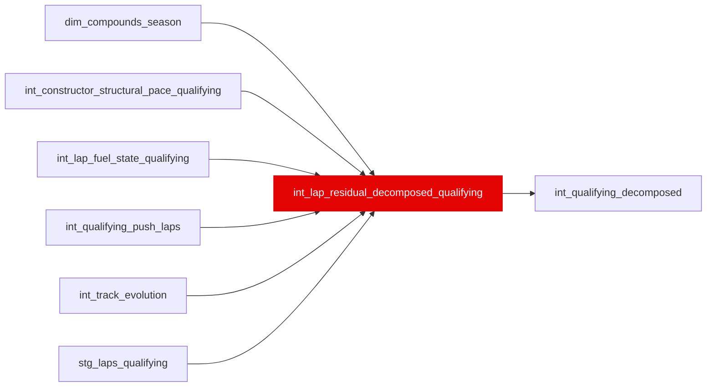

{/* _AUTOGENERATED   do not hand-edit. Run `python scripts/gen_dbt_reference.py` to regenerate. */}

<Note>Part of the [Residual](/transform/families/residual) family.</Note>

One row per qualifying lap. 7-term decomposition mirroring int_lap_residual_decomposed but with qualifying-specific coefficients (near-zero fuel, cliff-suppressed compound degradation, quali-mode car pace). Grain: lap_id. Enables quali-vs-race skill comparison.

## Lineage

## Overview

| Property | Value |
|---|---|
| Layer | `intermediate` |
| Family | [Residual](/transform/families/residual) |
| Contract enforced | No |
| Tags | `simulation`, `qualifying` |
| Upstream | [`int_qualifying_push_laps`](./int_qualifying_push_laps), [`stg_laps_qualifying`](../stg/stg_laps_qualifying), [`int_lap_fuel_state_qualifying`](./int_lap_fuel_state_qualifying), [`int_constructor_structural_pace_qualifying`](./int_constructor_structural_pace_qualifying), [`int_track_evolution`](./int_track_evolution), [`dim_compounds_season`](../dim/dim_compounds_season) |

**4 tests** [guard](/transform/ci/overview) this model  -  4 generic, 0 singular.

## Columns

| Column | Type | Nullable | Tests | Description |
|---|---|---|---|---|
| `lap_id` |   | Yes | [`not_null`](/transform/ci/structural), [`unique`](/transform/ci/structural) | PK, FK to stg_laps_qualifying |
| `quali_driver_skill_residual_s` |   | Yes | [`not_null`](/transform/ci/structural) | Driver pure quali skill residual   purer single-lap pace signal than race. The identity closes in closed form, so this term absorbs whatever the baseline gets wrong; gating the lap set to push laps and taking the baseline per segment moved its mean absolute value from 7.04s (sd 13.13) to 0.76s (sd 1.33), against a real qualifying field spread of ~1-3s. |
| `quali_segment` |   | Yes | [`not_null`](/transform/ci/structural) | Q1/Q2/Q3 segment the lap was set in (FK to int_qualifying_segments). |
| `base_track_pace_s` |   | Yes |   | Field-pace baseline: the median push lap of this lap's own segment, not of the whole session. |
| `ratio_to_segment_best` |   | Yes |   | lap_time_s / the best valid lap in the same segment. |
| `track_unexplained_s` |   | Yes |   | The track-evolution model's own residual for the event, carried informationally and deliberately not part of the identity   the same treatment as track_unexplained_s on the race side. Race-day proxy, like rubber_component_s and ambient_component_s here. |
