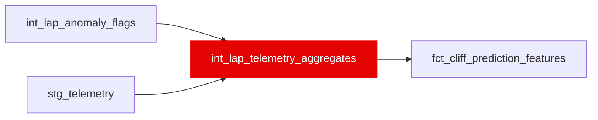

{/* _AUTOGENERATED   do not hand-edit. Run `python scripts/gen_dbt_reference.py` to regenerate. */}

<Note>Part of the [Physics](/transform/families/physics) family.</Note>

Per-lap telemetry features for the tyre-cliff model. One row per race lap. Powertrain aggregates (gear changes, rpm, full-throttle/DRS share, short-shift index) plus five within-stint-drift cliff signals (mid-corner speed loss, wheelspin proxy, throttle-trace decay, braking-point drift, lift-and-coast share), each measured vs the driver's own early-stint baseline. Computed lap-internally from the 'car' telemetry channel; NULL where a lap has no telemetry (explicit missingness, carried as XGBoost native-NaN).

## Lineage

## Overview

| Property | Value |
|---|---|
| Layer | `intermediate` |
| Family | [Physics](/transform/families/physics) |
| Contract enforced | No |
| Upstream | [`stg_telemetry`](../stg/stg_telemetry), [`int_lap_anomaly_flags`](./int_lap_anomaly_flags) |

**7 tests** [guard](/transform/ci/overview) this model  -  7 generic, 0 singular.

## Columns

| Column | Type | Nullable | Tests | Description |
|---|---|---|---|---|
| `lap_id` |   | Yes | [`not_null`](/transform/ci/structural), [`unique`](/transform/ci/structural) | Foreign key to stg_laps |
| `stint_id` |   | Yes | [`not_null`](/transform/ci/structural) | Stint surrogate key (baseline partition) |
| `pct_full_throttle` |   | Yes | [`accepted_range`](/transform/ci/range-and-domain) | Fraction of the lap at full throttle (0–1) |
| `pct_drs_active` |   | Yes | [`accepted_range`](/transform/ci/range-and-domain) | Fraction of the lap with DRS active (0–1) |
| `traction_wheelspin_proxy` |   | Yes | [`accepted_range`](/transform/ci/range-and-domain) | Share of corner-exit full-throttle samples with non-positive accel (0–1) |
| `lift_coast_share` |   | Yes | [`accepted_range`](/transform/ci/range-and-domain) | Off-throttle, non-braking, decelerating share of the lap (0–1) |
