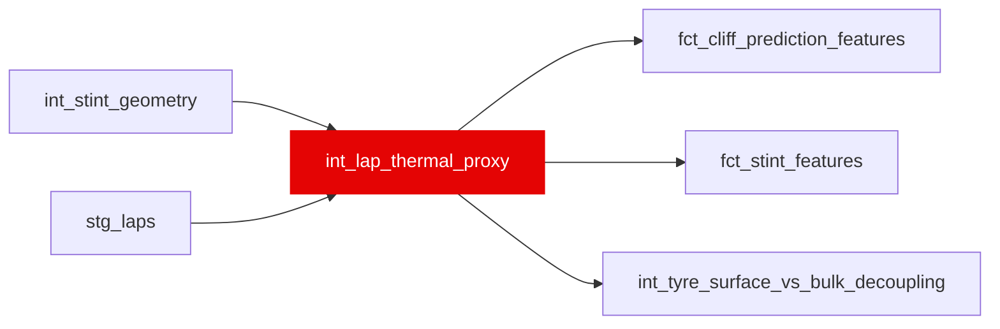

{/* _AUTOGENERATED   do not hand-edit. Run `python scripts/gen_dbt_reference.py` to regenerate. */}

<Note>Part of the [Physics](/transform/families/physics) family.</Note>

Cumulative push load from tyre thermal management. One row per lap. push_residual is the lap's pace against a POINT-IN-TIME stint baseline -- the expanding median of this stint's valid laps strictly before the scored lap (macro: trailing_median) -- and the two EW loads are backward sums over it. Rebuilt by 08e: the baseline was a MEDIAN over laps 1..CEIL(stint_length*0.60) per stint, which both pooled laps the scored lap had not yet run (55.92% of mart rows, mean 4.65 laps) and took its window width from stint_length_actual, the stint-life target's own numerator. That contamination did not merely add noise -- it inverted push_residual's sign against two of the three targets.

## Lineage

## Overview

| Property | Value |
|---|---|
| Layer | `intermediate` |
| Family | [Physics](/transform/families/physics) |
| Contract enforced | No |
| Upstream | [`int_stint_geometry`](./int_stint_geometry), [`stg_laps`](../stg/stg_laps) |

**6 tests** [guard](/transform/ci/overview) this model  -  4 generic, 2 singular.

## Columns

| Column | Type | Nullable | Tests | Description |
|---|---|---|---|---|
| `lap_id` |   | Yes | [`not_null`](/transform/ci/structural), [`unique`](/transform/ci/structural) | Foreign key to stg_laps |
| `stint_baseline_pace` |   | Yes |   | Median lap_time_s over this stint's VALID laps strictly before this one. Expanding, not trailing-N: a stint is short enough that the window stays local, and capping it would let the baseline drift with the degradation it measures. NULL until one valid prior lap exists -- usually laps 1-2, since lap 1 of a stint is an out-lap and not valid. Costs 1.41pp of training-eligible coverage against the old block median. |
| `baseline_observations_n` |   | Yes | [`not_null`](/transform/ci/structural), [`expect_column_values_to_be_between`](/transform/ci/range-and-domain) | How many valid prior laps stint_baseline_pace was computed from. Ships as a feature-contract column precisely because the baseline's NULLs are deterministic on it and on nothing else the contract carries: unlike 02a's rebuild, whose NULLs were declarable from age_in_stint, this count rises with SC and pit disruption and is plausibly correlated with the outcome. A consumer conditions on it; it must not be imputed away. |
| `push_residual` |   | Yes |   | stint_baseline_pace - lap_time_s. Positive = faster than the stint's own prior pace = pushing. NULL wherever the baseline is NULL: unknown, not zero. |
| `cumulative_push_load_surface` |   | Yes |   | EW sum of positive push_residual, tau~3 laps, 5-lap lookback. A NULL residual on a PRIOR lap contributes 0 (the same convention as laps before the stint began); a NULL residual on THIS lap makes the load NULL rather than 0, since GREATEST(NULL, 0) = 0 in DuckDB would fabricate "no thermal load" for a lap whose load is simply unknown. |
| `cumulative_push_load_bulk` |   | Yes |   | EW sum of positive push_residual, tau~5 laps, 8-lap lookback. Same NULL rule as cumulative_push_load_surface. |
