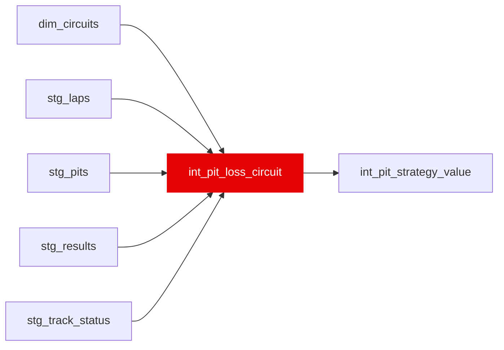

{/* _AUTOGENERATED   do not hand-edit. Run `python scripts/gen_dbt_reference.py` to regenerate. */}

<Note>Part of the [Strategy](/transform/families/strategy) family.</Note>

Empirical circuit-specific pit-lane loss prior, read by int_pit_strategy_value in place of the largely-imputed circuit_reference constant. Per stop, loss = (in_lap − ref) + (out_lap − ref) where ref is the driver's median green lap that race; the value is the median across stops within a sane [pit_loss_min_s, pit_loss_max_s] window, EB-shrunk toward the global median. Stops whose in-lap or out-lap ran under SC, VSC or a red flag are excluded — under a neutralisation the lap the stop is measured against is not the lap the driver would otherwise have run. Estimated per physical venue (circuit_id) so a renamed event or double-header shares one pit lane and one sample, then emitted per event slug so the consumer's race_to_track join is unchanged. Scoped to races with a venue slug available.

## Lineage

## Overview

| Property | Value |
|---|---|
| Layer | `intermediate` |
| Family | [Strategy](/transform/families/strategy) |
| Contract enforced | No |
| Upstream | [`stg_track_status`](../stg/stg_track_status), [`stg_results`](../stg/stg_results), [`dim_circuits`](../dim/dim_circuits), [`stg_laps`](../stg/stg_laps), [`stg_pits`](../stg/stg_pits) |

**9 tests** [guard](/transform/ci/overview) this model  -  8 generic, 1 singular.

## Columns

| Column | Type | Nullable | Tests | Description |
|---|---|---|---|---|
| `circuit_slug` |   | Yes | [`not_null`](/transform/ci/structural), [`unique`](/transform/ci/structural) | Event identifier (race name slug); recurs across seasons. PK. |
| `circuit_id` |   | Yes | [`not_null`](/transform/ci/structural) | Physical-venue identifier the estimate is pooled on. Several event slugs can share one circuit_id (british / 70th_anniversary, brazilian / são_paulo, mexican / mexico_city, austrian / styrian) and then carry identical values by construction. |
| `n_stops` |   | Yes | [`not_null`](/transform/ci/structural) | Number of clean green-flag pit stops observed at this physical venue. |
| `pit_loss_s_empirical` |   | Yes | [`not_null`](/transform/ci/structural), [`expect_column_values_to_be_between`](/transform/ci/range-and-domain) | Median empirical pit-lane loss (seconds) across observed stops. |
| `pit_loss_s_shrunk` |   | Yes | [`not_null`](/transform/ci/structural), [`expect_column_values_to_be_between`](/transform/ci/range-and-domain) | Pit-lane loss EB-shrunk toward the global median (pseudo-count pit_loss_prior_stops). |
