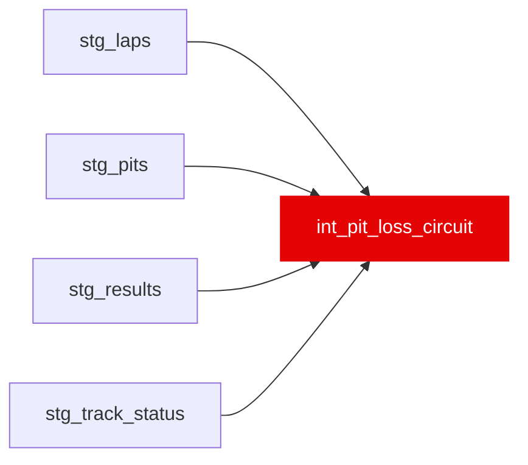

{/* _AUTOGENERATED   do not hand-edit. Run `python scripts/gen_dbt_reference.py` to regenerate. */}

<Note>Part of the [Strategy](/transform/families/strategy) family.</Note>

Empirical circuit-specific pit-lane loss prior, intended to replace the largely-imputed constant in circuit_reference. Per stop, loss = (in_lap − ref) + (out_lap − ref) where ref is the driver's median green lap that race; circuit value is the median across stops within a sane [pit_loss_min_s, pit_loss_max_s] window, EB-shrunk toward the global median. Scoped to races with a venue slug available. Not yet read by any downstream dbt model  -  int_pit_strategy_value still joins the circuit_reference seed constant directly.

## Lineage

## Overview

| Property | Value |
|---|---|
| Layer | `intermediate` |
| Family | [Strategy](/transform/families/strategy) |
| Contract enforced | No |
| Upstream | [`stg_track_status`](../stg/stg_track_status), [`stg_results`](../stg/stg_results), [`stg_laps`](../stg/stg_laps), [`stg_pits`](../stg/stg_pits) |

**7 tests** [guard](/transform/ci/overview) this model  -  7 generic, 0 singular.

## Columns

| Column | Type | Nullable | Tests | Description |
|---|---|---|---|---|
| `circuit_slug` |   | Yes | [`not_null`](/transform/ci/structural), [`unique`](/transform/ci/structural) | Venue identifier (race name slug); recurs across seasons. |
| `n_stops` |   | Yes | [`not_null`](/transform/ci/structural) | Number of clean pit stops observed at this circuit. |
| `pit_loss_s_empirical` |   | Yes | [`not_null`](/transform/ci/structural), [`expect_column_values_to_be_between`](/transform/ci/range-and-domain) | Median empirical pit-lane loss (seconds) across observed stops. |
| `pit_loss_s_shrunk` |   | Yes | [`not_null`](/transform/ci/structural), [`expect_column_values_to_be_between`](/transform/ci/range-and-domain) | Pit-lane loss EB-shrunk toward the global median (pseudo-count pit_loss_prior_stops). |
