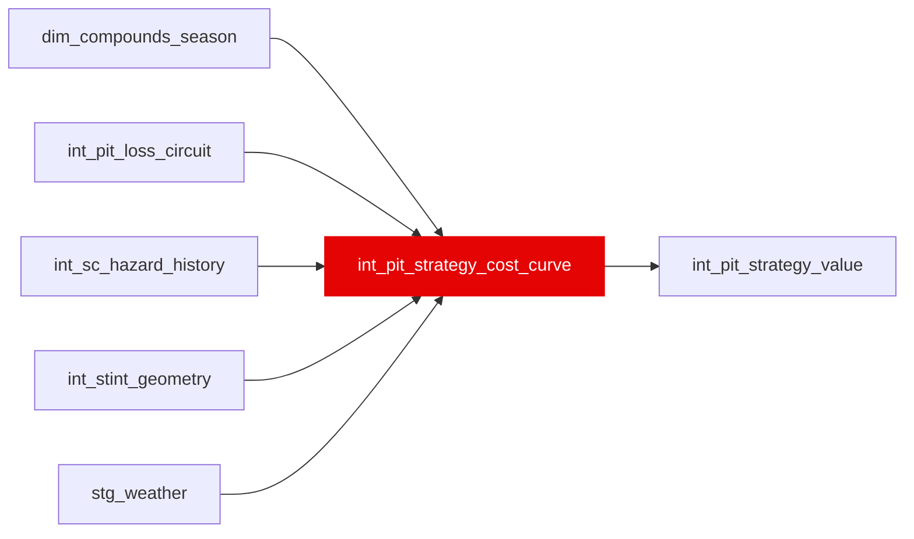

{/* _AUTOGENERATED   do not hand-edit. Run `python scripts/gen_dbt_reference.py` to regenerate. */}

<Note>Part of the [Strategy](/transform/families/strategy) family.</Note>

One row per (stint_id, horizon_scope, candidate_pit_lap_offset): the Total_Cost(L) surface int_pit_strategy_value's header described for two years and never computed. Cost of pitting after L laps on the current set = wear on the old set over those laps + wear on the next set over the rest of the horizon + a compound baseline offset + pit-lane loss discounted by the chance a safety car has already appeared. L = H is the no-stop candidate, which pays no pit term and is what makes a stop have to justify itself. THE SC DISCOUNT IS LOAD-BEARING: under a fixed one-stop the pit loss is the same whenever you take it, so it adds a constant to every candidate and cancels out of the argmin entirely - a longer pit lane would move nothing. Discounting it by 1 - (1 - m)(1 - (1 - h)^L), with h from int_sc_hazard_history, is what makes waiting pay and gives the model the property assert_pit_loss_pushes_optimum_later checks. Per-lap wear is capped at var('pit_strategy_max_wear_s_per_lap'): the cliff polynomial is unbounded, reaching 136 s/lap extrapolated to age 80 and already 93 s/lap in-sample.

## Lineage

## Overview

| Property | Value |
|---|---|
| Layer | `intermediate` |
| Family | [Strategy](/transform/families/strategy) |
| Contract enforced | No |
| Tags | `simulation`, `strategy` |
| Upstream | [`int_stint_geometry`](./int_stint_geometry), [`stg_weather`](../stg/stg_weather), [`dim_compounds_season`](../dim/dim_compounds_season), [`int_pit_loss_circuit`](./int_pit_loss_circuit), [`int_sc_hazard_history`](./int_sc_hazard_history) |
| Model-level tests | `unique_combination_of_columns` |

**18 tests** [guard](/transform/ci/overview) this model  -  16 generic, 2 singular.

## Columns

| Column | Type | Nullable | Tests | Description |
|---|---|---|---|---|
| `stint_id` |   | Yes | [`not_null`](/transform/ci/structural) | FK to int_stint_geometry. Part of the compound PK. |
| `horizon_scope` |   | Yes | [`not_null`](/transform/ci/structural), [`accepted_values`](/transform/ci/range-and-domain) | window = this stint's first lap through the next stint's last; race = through the driver's last lap of the race. Both are emitted for every stint that has them. |
| `horizon_laps` |   | Yes | [`not_null`](/transform/ci/structural) | Length of the horizon in valid laps. |
| `candidate_pit_lap_offset` |   | Yes | [`not_null`](/transform/ci/structural) | Laps run on the current set before boxing, in valid laps. Runs 1..horizon_laps; the last value is the no-stop candidate. Part of the compound PK. |
| `laps_on_new_set` |   | Yes | [`not_null`](/transform/ci/structural) | horizon_laps minus the offset. Zero for the no-stop candidate. |
| `old_wear_cost_s` |   | Yes | [`not_null`](/transform/ci/structural) | Cumulative wear over the laps run on the current set, evaluated on its own fitted curve from the age the stint opened on - a stint started on a used set begins part-way up that curve rather than at zero. |
| `new_wear_cost_s` |   | Yes | [`not_null`](/transform/ci/structural) | Cumulative wear over the rest of the horizon on the next set, from age 1. |
| `baseline_cost_s` |   | Yes | [`not_null`](/transform/ci/structural) | Per-lap pace offset between the two compounds (compound_grip_peak plus the optimal-temperature term) over the laps on the new set. Both inputs are per-compound CONSTANTS in compound_cliff_params, never fitted, and grip_peak as typed prices SOFT slower than HARD. var('pit_strategy_baseline_delta') decides whether this term is allowed to move the argmin; setting it FALSE zeroes this column. |
| `sc_hazard_per_lap` |   | Yes | [`not_null`](/transform/ci/structural) | Per-racing-lap SC/VSC hazard for the circuit, EB-shrunk, from int_sc_hazard_history. 0.0 for a circuit with no ingested track_status timeline, which makes the discount constant and returns the model to the pit-loss-cancels case. |
| `sc_probability` |   | Yes | [`expect_column_values_to_be_between`](/transform/ci/range-and-domain) | P(a caution has appeared within the candidate's laps) = 1 - (1 - h)^L. |
| `pit_discount_factor` |   | Yes | [`not_null`](/transform/ci/structural), [`expect_column_values_to_be_between`](/transform/ci/range-and-domain) | Fraction of the green-flag pit-lane loss this candidate expects to pay. Non-increasing in the candidate lap - asserted by assert_pit_discount_monotone - and a hard 0 for the no-stop candidate. |
| `wear_cost_s` |   | Yes | [`not_null`](/transform/ci/structural) | Everything that does not scale with pit_lane_loss_s. Split out so a consumer - or assert_pit_loss_pushes_optimum_later - can re-minimise at a different pit loss without rebuilding the curve. |
| `total_cost_s` |   | Yes | [`not_null`](/transform/ci/structural) | wear_cost_s + pit_lane_loss_s x pit_discount_factor. The argmin target. |
