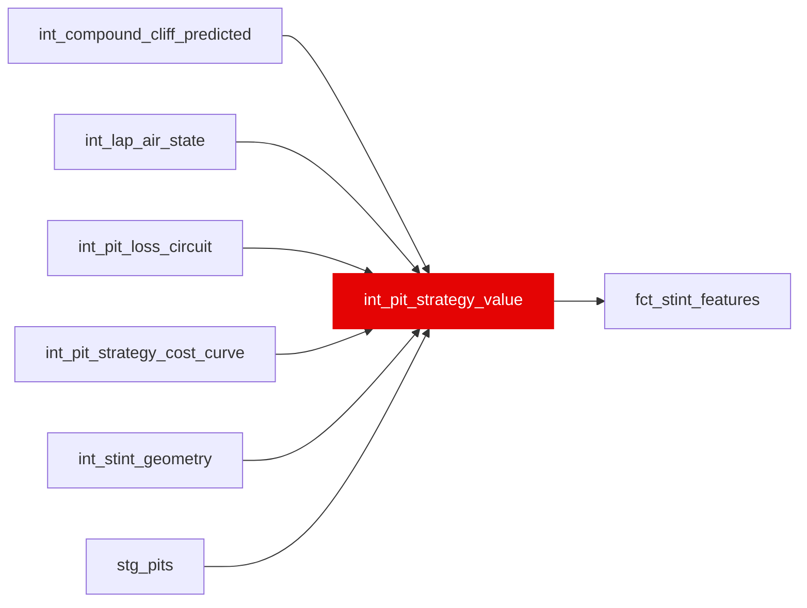

{/* _AUTOGENERATED   do not hand-edit. Run `python scripts/gen_dbt_reference.py` to regenerate. */}

<Note>Part of the [Strategy](/transform/families/strategy) family.</Note>

One row per stint. Evaluates pit strategy: what was the optimal pit lap vs actual? The argmin of int_pit_strategy_cost_curve's Total_Cost(L) over every candidate lap in the horizon, replacing the "first lap where expected wear exceeds 0.5 s" threshold that stood here until 2026-08-23 and had no pit-loss term in it. That threshold returned 'optimal' on 8 stints of 7,129 and 'unknown' on 2,231; the argmin returns 715 and 266. Two horizons are reported. The verdict follows the two-stint window (this stint's first lap through the next stint's last), the only framing well posed for the 61% of stints in a 2-stop or longer race; the race-remainder optimum is carried alongside as a diagnostic. opportunity_cost_s is now Total_Cost(actual) - Total_Cost(optimal), so pitting early carries a cost too, which the overrun-only definition could not express. Pit-loss is per circuit from int_pit_loss_circuit's empirical, EB-shrunk estimate (19.3–29.6 s over the 147 races that resolve one), falling back to the circuit_reference seed and then 21.0 s; pit_loss_source records which was used.

## Lineage

## Overview

| Property | Value |
|---|---|
| Layer | `intermediate` |
| Family | [Strategy](/transform/families/strategy) |
| Contract enforced | No |
| Tags | `simulation`, `strategy` |
| Upstream | [`int_stint_geometry`](./int_stint_geometry), [`int_compound_cliff_predicted`](./int_compound_cliff_predicted), [`int_pit_loss_circuit`](./int_pit_loss_circuit), [`stg_pits`](../stg/stg_pits), [`int_lap_air_state`](./int_lap_air_state), [`int_pit_strategy_cost_curve`](./int_pit_strategy_cost_curve) |

**12 tests** [guard](/transform/ci/overview) this model  -  12 generic, 0 singular.

## Columns

| Column | Type | Nullable | Tests | Description |
|---|---|---|---|---|
| `stint_id` |   | Yes | [`not_null`](/transform/ci/structural), [`unique`](/transform/ci/structural) | PK, FK to int_stint_geometry |
| `optimal_pit_lap` |   | Yes |   | Optimal pit lap number (absolute race lap) - the lap the car enters the pit lane, i.e. one after the last lap run on the set, matching stg_pits.pit_in_lap_number. NULL when the compound has no fitted curve to minimise over. |
| `optimal_pit_lap_in_stint` |   | Yes |   | Optimal laps to run on the set before boxing, counted in VALID laps. Not a chronological lap_in_stint: SC and pit laps do not age a tyre the way a racing lap does, and the cost curve is indexed on tyre age. |
| `actual_pit_lap` |   | Yes |   | Actual pit lap number from stg_pits. NULL for last stint of race. |
| `overrun_laps` |   | Yes |   | Actual laps run on the set minus optimal, in valid laps. Negative = pitted early. Compared as offsets rather than lap numbers so an invalid lap before the stop cannot skew it. NULL when either side is NULL. Median -1 across seven seasons: teams stop slightly earlier than a degradation-only optimum, which is what track position buys. |
| `opportunity_cost_s` |   | Yes | [`expect_column_values_to_be_between`](/transform/ci/range-and-domain) | Total_Cost(actual) - Total_Cost(optimal), in seconds. Non-negative by construction: the optimum is a minimum over the same curve. Zero for a stint that never stopped, which had no pit decision to grade. Median 5.5 s, p95 83 s. |
| `strategy_verdict` |   | Yes | [`accepted_values`](/transform/ci/range-and-domain) | Strategy classification. |
| `optimal_pit_lap_confidence` |   | Yes | [`expect_column_values_to_be_between`](/transform/ci/range-and-domain) | How sharply identified the optimum is: the share of candidate laps whose total cost is more than a second worse than it. 1.0 = one lap stands out; near 0 = the curve is flat and the exact lap barely matters. 0.0 where no curve exists. Replaces the 0.0/0.1/0.8 sentinel ladder, which encoded whether cliff onset was NULL rather than anything about the estimate. |
| `pit_lane_loss_s` |   | Yes | [`not_null`](/transform/ci/structural), [`expect_column_values_to_be_between`](/transform/ci/range-and-domain) | Pit-lane loss used for this stint's undercut-threat scan, in seconds. Empirical where int_pit_loss_circuit resolves the venue, else the circuit_reference seed, else 21.0. |
| `pit_loss_source` |   | Yes | [`not_null`](/transform/ci/structural), [`accepted_values`](/transform/ci/range-and-domain) | Which pit-loss estimate this row used - empirical / seed / default. |
| `pit_loss_imputed_flag` |   | Yes | [`not_null`](/transform/ci/structural) | TRUE when nothing was measured on either side - no empirical stops resolved and the seed row was itself a guess. |
| `horizon_source` |   | Yes | [`accepted_values`](/transform/ci/range-and-domain) | Which horizon the verdict's argmin used - two_stint (4,014 stints) or the race_remainder fallback for a stint with no successor (2,642). NULL where no fitted compound curve exists to minimise over (473). |
| `horizon_laps` |   | Yes |   | Length of that horizon in valid laps. |
| `optimal_pit_lap_race_in_stint` |   | Yes |   | The race-remainder optimum, in valid laps on the set. Diagnostic: asks the harsher unconditional question "if they had stopped only once more all race, when?" rather than grading the stop inside the strategy the team actually ran. |
| `optimal_pit_lap_race` |   | Yes |   | Absolute race lap for optimal_pit_lap_race_in_stint. |
| `opportunity_cost_race_s` |   | Yes | [`expect_column_values_to_be_between`](/transform/ci/range-and-domain) | The same actual-minus-optimal difference measured on the race-remainder horizon. Systematically larger than opportunity_cost_s for a 2-stopper, because a one-stop counterfactual charges them for a stop they were never going to skip. |
