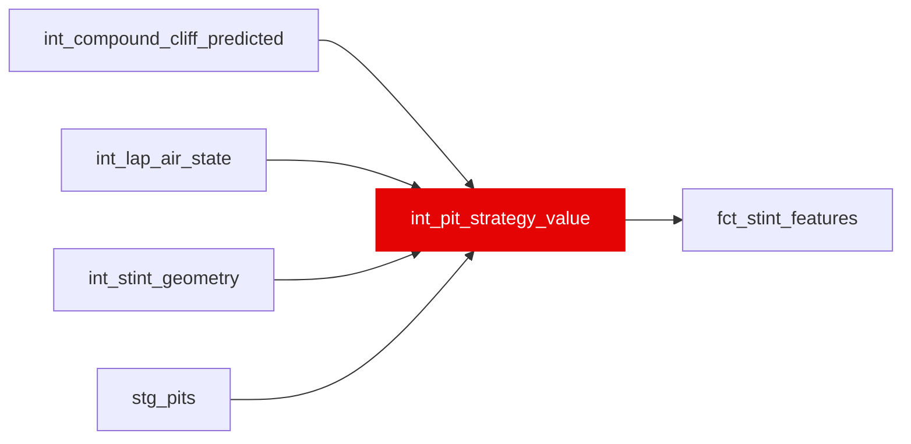

{/* _AUTOGENERATED   do not hand-edit. Run `python scripts/gen_dbt_reference.py` to regenerate. */}

<Note>Part of the [Strategy](/transform/families/strategy) family.</Note>

One row per stint. Evaluates pit strategy: what was the optimal pit lap vs actual? Computes opportunity_cost_s (seconds lost by pitting late), optimal_pit_lap, and verdict (optimal / overran / undercut_forced / early). Counterfactual assumes cliff model degradation trajectory. Pit-loss constant per circuit (~21 s average); missing circuits imputed at 21.0 s.

## Lineage

## Overview

| Property | Value |
|---|---|
| Layer | `intermediate` |
| Family | [Strategy](/transform/families/strategy) |
| Contract enforced | No |
| Tags | `simulation`, `strategy` |
| Upstream | [`int_stint_geometry`](./int_stint_geometry), [`int_compound_cliff_predicted`](./int_compound_cliff_predicted), [`stg_pits`](../stg/stg_pits), [`int_lap_air_state`](./int_lap_air_state) |

**5 tests** [guard](/transform/ci/overview) this model  -  5 generic, 0 singular.

## Columns

| Column | Type | Nullable | Tests | Description |
|---|---|---|---|---|
| `stint_id` |   | Yes | [`not_null`](/transform/ci/structural), [`unique`](/transform/ci/structural) | PK, FK to int_stint_geometry |
| `optimal_pit_lap` |   | Yes |   | Optimal pit lap number (absolute race lap). NULL when cliff onset unknown. |
| `actual_pit_lap` |   | Yes |   | Actual pit lap number from stg_pits. NULL for last stint of race. |
| `overrun_laps` |   | Yes |   | actual_pit_lap minus optimal_pit_lap. Negative = pitted early. NULL when either is NULL. |
| `opportunity_cost_s` |   | Yes | [`expect_column_values_to_be_between`](/transform/ci/range-and-domain) | Cumulative degradation penalty from overrunning optimal. Non-negative. |
| `strategy_verdict` |   | Yes | [`accepted_values`](/transform/ci/range-and-domain) | Strategy classification. |
| `optimal_pit_lap_confidence` |   | Yes | [`expect_column_values_to_be_between`](/transform/ci/range-and-domain) | Confidence in optimal lap estimate [0, 1]. Degrades when cliff onset is NULL. |
