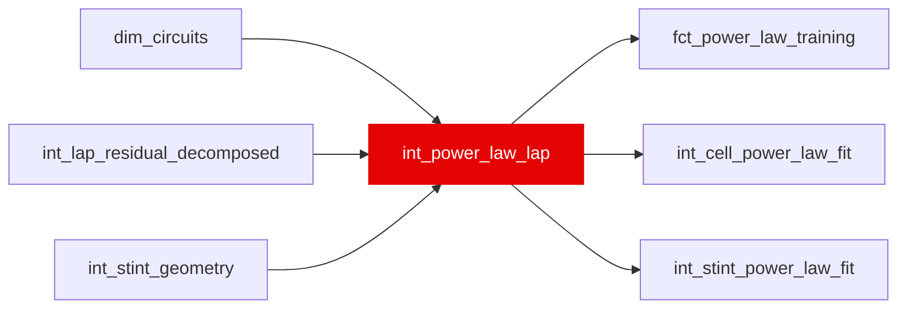

{/* _AUTOGENERATED   do not hand-edit. Run `python scripts/gen_dbt_reference.py` to regenerate. */}

<Note>Part of the [Physics](/transform/families/physics) family.</Note>

WI-17: the one lap set every power-law fit, the Step-0 identification check (ml/src/powerlaw_ceiling.py) and the held-out grading in ml/src/powerlaw.py read. Slick laps with mart_degradation_history_envelope's filters (correction_weight = 1, no SC / VSC / red flag, not a major outlier), tyre age 1-50. y_s is weight_corrected_lap_time: the WI's pre-flight probe also subtracted rubber_component_s, which Step 0 dropped because int_field_pace_curve (its source) is priced from the compound seed and the P3 truth is not net of it (see the model header and the WI's As built). Compound identity is a hardness rank from compound_hardness_scale: 2018 from the lap's own name, 2019+ from compound_code, NULL for 2025 (tyre_allocations stops at 2024, W50). T52 pins the 2018 rule; T51 the column guard.

## Lineage

## Overview

| Property | Value |
|---|---|
| Layer | `intermediate` |
| Family | [Physics](/transform/families/physics) |
| Contract enforced | No |
| Upstream | [`int_lap_residual_decomposed`](./int_lap_residual_decomposed), [`int_stint_geometry`](./int_stint_geometry), [`dim_circuits`](../dim/dim_circuits) |

**14 tests** [guard](/transform/ci/overview) this model  -  11 generic, 3 singular.

## Columns

| Column | Type | Nullable | Tests | Description |
|---|---|---|---|---|
| `lap_id` |   | Yes | [`not_null`](/transform/ci/structural), [`unique`](/transform/ci/structural) |  |
| `stint_id` |   | Yes | [`not_null`](/transform/ci/structural) |  |
| `race_id` |   | Yes | [`not_null`](/transform/ci/structural) |  |
| `age_in_stint` |   | Yes | [`not_null`](/transform/ci/structural), [`expect_column_values_to_be_between`](/transform/ci/range-and-domain) | Tyre age (tyre life, so a used set starts above 1), 1-50. |
| `compound_label` |   | Yes | [`not_null`](/transform/ci/structural), [`accepted_values`](/transform/ci/range-and-domain) | The lap's own compound name (absolute in 2018, relative HARD/MEDIUM/SOFT from 2019). Slicks only. |
| `hardness_era` |   | Yes | [`not_null`](/transform/ci/structural), [`accepted_values`](/transform/ci/range-and-domain) |  |
| `hardness_identity` |   | Yes |   | What the rank is looked up on -- compound_label in 2018, compound_code from 2019. |
| `compound_hardness_rank` |   | Yes |   | compound_hardness_scale.hardness_rank (1 = hardest). NULL only where the identity is (2025). |
| `y_s` |   | Yes | [`not_null`](/transform/ci/structural) | The fitted quantity, weight_corrected_lap_time (s). |
| `track_temp_c` |   | Yes |   | Track temperature on the lap (stg_weather via int_track_evolution, a pass-through of the reading). |
| `constructor_pace_s` |   | Yes |   | int_constructor_structural_pace's per-(race, constructor) coefficient on the lap (s). |
