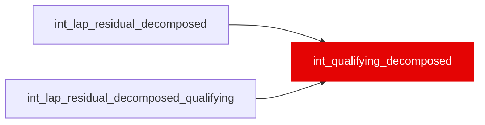

{/* _AUTOGENERATED   do not hand-edit. Run `python scripts/gen_dbt_reference.py` to regenerate. */}

<Note>Part of the [Residual](/transform/families/residual) family.</Note>

One row per qualifying lap. 7-term residual decomposition (public-facing) plus quali_vs_race_skill_delta_s: how much faster/slower is this driver in qualifying vs their race average? Positive = single-lap specialist. Grain: lap_id. Used in analytics dashboards to profile driver strengths.

## Lineage

## Overview

| Property | Value |
|---|---|
| Layer | `intermediate` |
| Family | [Residual](/transform/families/residual) |
| Contract enforced | No |
| Tags | `simulation`, `qualifying` |
| Upstream | [`int_lap_residual_decomposed_qualifying`](./int_lap_residual_decomposed_qualifying), [`int_lap_residual_decomposed`](./int_lap_residual_decomposed) |

**5 tests** [guard](/transform/ci/overview) this model  -  4 generic, 1 singular.

## Columns

| Column | Type | Nullable | Tests | Description |
|---|---|---|---|---|
| `lap_id` |   | Yes | [`not_null`](/transform/ci/structural), [`unique`](/transform/ci/structural) | PK, FK to stg_laps_qualifying |
| `quali_skill_residual_s` |   | Yes | [`not_null`](/transform/ci/structural) | Per-lap qualifying driver skill residual. |
| `quali_vs_race_skill_delta_s` |   | Yes |   | Per-driver per-event differential between qualifying and race skill. Positive = qualifying specialist. NULL when no race data available for that event. |
| `quali_skill_session_avg_s` |   | Yes |   | Driver's qualifying skill for the event: the residual of their best push lap in each segment, averaged over the segments they contested. Previously the mean over every lap FastF1 flagged IsPersonalBest, which fires on every improving lap (4.58 per driver-race, up to 15) and charged a driver who built up incrementally as much as ~4s of pure aggregation artefact. |
| `quali_segments_contested_n` |   | Yes |   | Segments (1-3) in which the driver set a best push lap. |
| `quali_segment` |   | Yes | [`not_null`](/transform/ci/structural) | Q1/Q2/Q3 segment the lap was set in (FK to int_qualifying_segments). |
