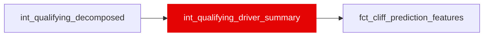

{/* _AUTOGENERATED   do not hand-edit. Run `python scripts/gen_dbt_reference.py` to regenerate. */}

<Note>Part of the [Pace Baselines](/transform/families/pace-baselines) family.</Note>

02b (Tier 1). Driver-weekend qualifying summary, one row per (race_year, race_id, driver_id), read off int_qualifying_decomposed's push-lap rows and rolled up to the whole qualifying session. The first channel in the feature contract's lineage sourced from a strictly-prior SESSION rather than a further transform of race-lap residuals -- qualifying runs before the race, so no lag/expanding-window treatment is needed, PROVIDED (as here) every input column is itself scoped to the qualifying session.
quali_vs_race_skill_delta_s is DELIBERATELY NOT CARRIED. int_qualifying_decomposed computes it by subtracting a same-race average of driver_skill_residual_s (race_driver_race_avg) -- a race-session aggregate not knowable until the race has finished, the same forward-reach shape 02a ruled on in int_corner_skill_residuals, one grain coarser (the whole race instead of a 5-lap bucket). See this model's own SQL header and int_qualifying_decomposed's own aggregation_scope_exemptions entry above for the full ruling.
HONEST CEILING. This grain is stint-invariant: every lap of a driver's race sees the same value. Per the leaf doc's §1, 99.06% of the degradation target's variance is within-stint, so this group can only ever address the other 0.94%. Expected to move cliff_classifier and/or stint_life_regressor, not the degradation trio -- 02b's pre-registered arms test that expectation, they do not assume it.

## Lineage

## Overview

| Property | Value |
|---|---|
| Layer | `intermediate` |
| Family | [Pace Baselines](/transform/families/pace-baselines) |
| Contract enforced | No |
| Tags | `feature_engineering` |
| Upstream | [`int_qualifying_decomposed`](./int_qualifying_decomposed) |
| Model-level tests | `unique_combination_of_columns` |

**5 tests** [guard](/transform/ci/overview) this model  -  5 generic, 0 singular.

## Columns

| Column | Type | Nullable | Tests | Description |
|---|---|---|---|---|
| `race_year` |   | Yes | [`not_null`](/transform/ci/structural) | Season year. |
| `race_id` |   | Yes | [`not_null`](/transform/ci/structural) | Race identifier. |
| `driver_id` |   | Yes | [`not_null`](/transform/ci/structural) | FastF1 three-letter driver code. |
| `quali_push_laps_n` |   | Yes | [`not_null`](/transform/ci/structural) | Push laps this driver set across Q1/Q2/Q3 this weekend (COUNT(*) over int_qualifying_decomposed's push-lap rows for this driver-weekend). The mart COALESCEs this to 0 for a driver-weekend with no row here at all -- a genuine "no qualifying record" (DNQ or a data gap), not an invented value. |
| `quali_constructor_pace_mean_s` |   | Yes |   | Mean constructor_component_s over the driver's push laps this weekend: a car's one-lap aero/power level, measured with fuel, strategy and traffic all near-absent. MEAN smooths Q1/Q2/Q3 segment-to-segment noise in a term expected to be near-stable across one weekend. |
| `quali_constructor_pace_se_mean_s` |   | Yes |   | Mean of constructor_component_se_s over the same push laps -- the average estimation uncertainty on the pace term above. |
| `quali_pace_delta_best_s` |   | Yes |   | MIN(quali_pace_delta_s) over the weekend, i.e. the driver's single best push lap: quali_pace_delta_s is positive/higher = slower by construction (see int_lap_residual_decomposed_qualifying's header), so MIN is the fastest lap. |
| `quali_ratio_to_segment_best_min` |   | Yes |   | MIN(ratio_to_segment_best) over the weekend -- how close the driver's best lap in any segment came to that segment's own fastest push lap. Same "higher = slower" orientation as quali_pace_delta_best_s above. |
| `quali_skill_session_avg_s` |   | Yes |   | MAX(quali_skill_session_avg_s) over the driver's push-lap rows. Already computed at this exact (race_year, race_id, driver_id) grain one level up in int_qualifying_decomposed and repeated on every push-lap row there, so MAX is a value-preserving collapse of an already-constant column, not a real aggregation -- the same property 02c's QUALIFY ROW_NUMBER() dedupe relies on for its own repeated-value rows. |
| `quali_segments_contested_n` |   | Yes |   | MAX(quali_segments_contested_n) over the driver's push-lap rows -- same value-preserving collapse as quali_skill_session_avg_s above. Segments (1-3) in which the driver set a best push lap. |
