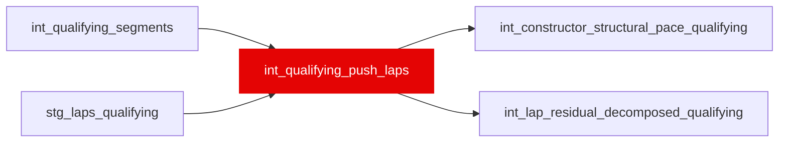

{/* _AUTOGENERATED   do not hand-edit. Run `python scripts/gen_dbt_reference.py` to regenerate. */}

<Note>Part of the [Pace Baselines](/transform/families/pace-baselines) family.</Note>

One row per qualifying lap (gated or not, so consumers filter rather than lose the row set). Assigns each lap to its Q1/Q2/Q3 segment and applies the push-lap gate that stg_laps_qualifying cannot: is_valid_lap removes out-laps and in-laps, but not the cool-down lap between two push laps, which carries no pit time and passes every other check. 25% of the laps previously treated as valid were more than 107% off their segment's best.

## Lineage

## Overview

| Property | Value |
|---|---|
| Layer | `intermediate` |
| Family | [Pace Baselines](/transform/families/pace-baselines) |
| Contract enforced | No |
| Tags | `simulation`, `qualifying` |
| Upstream | [`stg_laps_qualifying`](../stg/stg_laps_qualifying), [`int_qualifying_segments`](./int_qualifying_segments) |

**8 tests** [guard](/transform/ci/overview) this model  -  7 generic, 1 singular.

## Columns

| Column | Type | Nullable | Tests | Description |
|---|---|---|---|---|
| `lap_id` |   | Yes | [`not_null`](/transform/ci/structural), [`unique`](/transform/ci/structural) | PK, FK to stg_laps_qualifying. |
| `race_year` |   | Yes | [`not_null`](/transform/ci/structural) | Season year. |
| `race_id` |   | Yes | [`not_null`](/transform/ci/structural) | Numeric FastF1 event id. |
| `driver_id` |   | Yes | [`not_null`](/transform/ci/structural) | FastF1 three-letter driver code. |
| `quali_segment` |   | Yes | [`not_null`](/transform/ci/structural) | Segment the lap was set in   'Q1', 'Q2' or 'Q3', or 'Q' when the session has no recoverable segment structure (the pre-segment behaviour, not a dropped row). |
| `segment_best_s` |   | Yes |   | Fastest valid lap set in this session's segment. |
| `driver_segment_best_s` |   | Yes |   | This driver's fastest valid lap in this session's segment. |
| `ratio_to_segment_best` |   | Yes |   | lap_time_s / segment_best_s. Above 1.07 on a push lap means the lap was admitted by the driver's-own-best carve-out rather than the 107% cut   43 laps of 14,165, a handful of which are aborted runs that were the driver's only lap in the segment. Filter on this if you need a stricter set. |
| `is_push_lap` |   | Yes | [`not_null`](/transform/ci/structural) | The gate: a valid, timed lap within quali_push_lap_ratio (1.07) of its segment's best, or the driver's own best lap in that segment so that no driver drops out of the decomposition entirely. |
