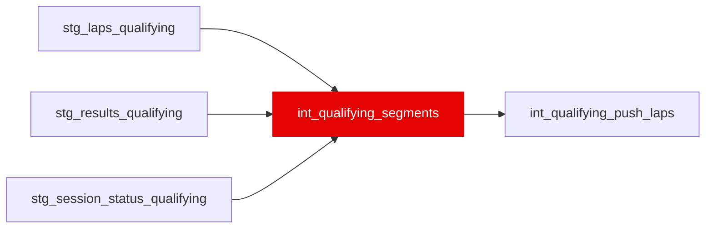

{/* _AUTOGENERATED   do not hand-edit. Run `python scripts/gen_dbt_reference.py` to regenerate. */}

<Note>Part of the [Pace Baselines](/transform/families/pace-baselines) family.</Note>

One row per (race_year, race_id, quali_segment). The Q1/Q2/Q3 windows of each qualifying session, recovered by anchoring the session-status timeline (stg_session_status_qualifying) to the official per-driver segment times (stg_results_qualifying). FastF1 reports one flat lap set per Q session with no segment column, so before this model every qualifying baseline was computed per race   pooling a Q1 first effort with a Q3 final lap across ~1s of track evolution and a self-selected top-10 field. Verified against the official results by assert_quali_segment_matches_official.

## Lineage

## Overview

| Property | Value |
|---|---|
| Layer | `intermediate` |
| Family | [Pace Baselines](/transform/families/pace-baselines) |
| Contract enforced | No |
| Tags | `simulation`, `qualifying` |
| Upstream | [`stg_session_status_qualifying`](../stg/stg_session_status_qualifying), [`stg_results_qualifying`](../stg/stg_results_qualifying), [`stg_laps_qualifying`](../stg/stg_laps_qualifying) |

**8 tests** [guard](/transform/ci/overview) this model  -  8 generic, 0 singular.

## Columns

| Column | Type | Nullable | Tests | Description |
|---|---|---|---|---|
| `quali_segment_id` |   | Yes | [`not_null`](/transform/ci/structural), [`unique`](/transform/ci/structural) | Surrogate PK = concat(race_id, '_Q', segment_index). |
| `race_year` |   | Yes | [`not_null`](/transform/ci/structural) | Season year. |
| `race_id` |   | Yes | [`not_null`](/transform/ci/structural) | Numeric FastF1 event id; matches stg_laps_qualifying.race_id. |
| `quali_segment` |   | Yes | [`not_null`](/transform/ci/structural), [`accepted_values`](/transform/ci/range-and-domain) | Segment label   'Q1', 'Q2' or 'Q3'. |
| `segment_index` |   | Yes | [`not_null`](/transform/ci/structural) | 1 for Q1, 2 for Q2, 3 for Q3. |
| `segment_start_s` |   | Yes | [`not_null`](/transform/ci/structural) | Session clock (s) at the segment's green light. |
| `segment_end_s` |   | Yes |   | Session clock (s) at the segment's chequered flag; the unresumed red flag that ended it, or the session's 'Finalised', when no chequered flag fell. |
| `segment_span_s` |   | Yes |   | segment_end_s minus segment_start_s. Nominally 1080s (Q1), 900s (Q2), 720s (Q3); longer when a red flag suspended the clock. |
| `stoppage_n` |   | Yes |   | Red-flag stoppages ('Aborted' events) inside the segment window. |
| `anchor_lap_n` |   | Yes |   | Official segment times matched back to the lap that set them. Diagnostic   a low count means the segment's boundary rests on few anchors. |
| `window_start_s` |   | Yes |   | Lower bound (inclusive) for assigning a lap to this segment by lap_start_time_s. NULL for Q1, whose window is open at the bottom so pre-session installation laps land there. |
| `window_end_s` |   | Yes |   | Upper bound (exclusive) = the next segment's green light. NULL for Q3. Deliberately not the chequered flag: the in-lap every driver runs starts after it and still belongs to the segment. |
