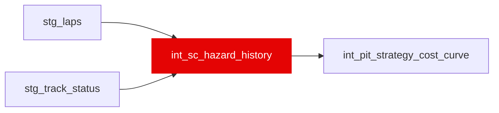

{/* _AUTOGENERATED   do not hand-edit. Run `python scripts/gen_dbt_reference.py` to regenerate. */}

<Note>Part of the [Strategy](/transform/families/strategy) family.</Note>

Safety-Car / Virtual-Safety-Car base rate per circuit (venue slug) as a hazard per racing lap, POINT-IN-TIME AS OF THE START OF EACH SEASON. Grain is one row per (circuit_slug, season); the rate on a row is estimated from races at that circuit in seasons STRICTLY BEFORE it, so a 2019 row never sees 2019 or later. Estimated from SC/VSC deployment onsets in stg_track_status with racing-lap exposure from stg_laps. Raw and empirical-Bayes-shrunk rates are provided; the EB prior is itself season-lagged (pooled over all circuits, seasons &lt; S), because shrinking toward an all-time pooled rate would leak the future through the prior.

REBUILT 2026-09-11 (work item 02d). The previous version pooled every season into ONE row per circuit, so a 2018 consumer read a hazard partly estimated from 2024 races. Any consumer must now join on (circuit_slug, season), not circuit_slug alone -- a circuit-only join silently fans out 5-7x and reinstates the leak. int_pit_strategy_cost_curve is the one dbt consumer and was updated with it.

TRACK-STATUS COVERAGE, measured against data/dev.duckdb on 2026-09-11. The old header warned ingestion was "incomplete for some seasons"; that caveat was stale. Every race with laps has a track_status timeline: 2018 21/21, 2019 21/21, 2020 17/17, 2021 22/22, 2022 22/22, 2023 22/22, 2024 24/24 -- 148/148, 100% in every season. Timelines are thin on incident-free races (19 races carry &lt;= 3 messages, the minimum being a single AllClear), which is an absence of events rather than an absence of ingestion, and the hazard numerator counts onsets so it reads those correctly as zero.

MISSINGNESS, deterministic and declarable. The raw rates are NULL where a circuit has no prior exposure -- its debut season -- because "unknowable" and "measured, no onsets" are different statements: 36 rows of 149, one per circuit. The shrunk rates survive a circuit debut (zero prior exposure shrinks fully to the pooled prior, the correct EB answer) and are NULL only where the pooled prior is itself unknowable: all 21 rows of season 2018, the earliest season in the warehouse. Both NULL sets are deterministic on (circuit_slug, season) and readable off the companion prior_seasons_n / prior_racing_laps columns, which are never NULL.

## Lineage

## Overview

| Property | Value |
|---|---|
| Layer | `intermediate` |
| Family | [Strategy](/transform/families/strategy) |
| Contract enforced | No |
| Upstream | [`stg_track_status`](../stg/stg_track_status), [`stg_laps`](../stg/stg_laps) |
| Model-level tests | `unique_combination_of_columns` |

**19 tests** [guard](/transform/ci/overview) this model  -  17 generic, 2 singular.

## Columns

| Column | Type | Nullable | Tests | Description |
|---|---|---|---|---|
| `circuit_slug` |   | Yes | [`not_null`](/transform/ci/structural) | Venue identifier (race name slug, e.g. monaco_grand_prix); recurs across seasons. |
| `season` |   | Yes | [`not_null`](/transform/ci/structural) | The season this estimate is "as of the start of". The estimate uses seasons &lt; this value only; the current season's own races are deliberately excluded, so the value is constant across a season. |
| `season_races_n` |   | Yes | [`not_null`](/transform/ci/structural) | Races at this circuit in THIS season -- exposure the season lag deliberately excludes from the estimate. Carried so a consumer can see how much is being withheld, not as an input to any rate. |
| `prior_seasons_n` |   | Yes | [`not_null`](/transform/ci/structural) | Distinct earlier seasons contributing to the estimate. 0 on a circuit's debut season; never NULL. This is the companion count that makes the rate NULLs explainable from the data. |
| `prior_races_n` |   | Yes | [`not_null`](/transform/ci/structural) | Races in the estimate (this circuit, seasons &lt; season). 0 on a debut; never NULL. |
| `prior_racing_laps` |   | Yes | [`not_null`](/transform/ci/structural), [`expect_column_values_to_be_between`](/transform/ci/range-and-domain) | Racing-lap exposure in the estimate (sum of per-race leader lap counts over seasons &lt; season) -- the hazard denominator. 0 on a debut season; never NULL. |
| `prior_sc_onsets` |   | Yes | [`not_null`](/transform/ci/structural) | Safety-Car onsets in the estimate window. Never NULL. |
| `prior_vsc_onsets` |   | Yes | [`not_null`](/transform/ci/structural) | Virtual-Safety-Car onsets in the estimate window. Never NULL. |
| `prior_any_onsets` |   | Yes | [`not_null`](/transform/ci/structural) | Combined SC+VSC onsets in the estimate window. Never NULL. |
| `sc_hazard_per_lap` |   | Yes | [`expect_column_values_to_be_between`](/transform/ci/range-and-domain) | Raw Safety-Car onsets per racing lap over seasons &lt; season. NULL on a circuit's debut season (no prior exposure) -- see the model description's missingness note. |
| `vsc_hazard_per_lap` |   | Yes | [`expect_column_values_to_be_between`](/transform/ci/range-and-domain) | Raw Virtual-Safety-Car onsets per racing lap over seasons &lt; season. NULL on a circuit's debut season. |
| `any_hazard_per_lap` |   | Yes | [`expect_column_values_to_be_between`](/transform/ci/range-and-domain) | Raw combined SC+VSC onsets per racing lap over seasons &lt; season. NULL on a circuit's debut season. |
| `sc_hazard_per_lap_shrunk` |   | Yes | [`expect_column_values_to_be_between`](/transform/ci/range-and-domain) | Empirical-Bayes SC hazard shrunk toward the season-lagged pooled rate (pseudo-count sc_hazard_prior_laps). NULL only for season 2018, which has no prior season to pool. |
| `vsc_hazard_per_lap_shrunk` |   | Yes | [`expect_column_values_to_be_between`](/transform/ci/range-and-domain) | Empirical-Bayes VSC hazard shrunk toward the season-lagged pooled rate. NULL only for season 2018. |
| `any_hazard_per_lap_shrunk` |   | Yes | [`expect_column_values_to_be_between`](/transform/ci/range-and-domain) | Empirical-Bayes combined SC+VSC hazard shrunk toward the season-lagged pooled rate. NULL only for season 2018. |
