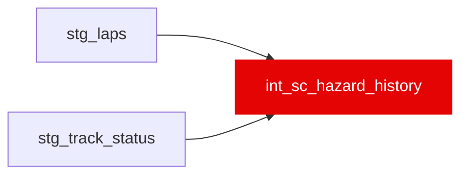

{/* _AUTOGENERATED   do not hand-edit. Run `python scripts/gen_dbt_reference.py` to regenerate. */}

<Note>Part of the [Strategy](/transform/families/strategy) family.</Note>

Safety-Car / Virtual-Safety-Car base rate per circuit (venue slug), as a hazard per racing lap. Estimated from SC/VSC deployment onsets in stg_track_status with racing-lap exposure from stg_laps, over the set of races that have an ingested track_status timeline. Raw and empirical-Bayes-shrunk rates are provided. Not yet read by any downstream dbt model or app feature  -  scripts/mc_finish_order.py (the Monte Carlo finish-order roll-forward) is a candidate consumer but does not read this model today.

## Lineage

## Overview

| Property | Value |
|---|---|
| Layer | `intermediate` |
| Family | [Strategy](/transform/families/strategy) |
| Contract enforced | No |
| Upstream | [`stg_track_status`](../stg/stg_track_status), [`stg_laps`](../stg/stg_laps) |

**18 tests** [guard](/transform/ci/overview) this model  -  17 generic, 1 singular.

## Columns

| Column | Type | Nullable | Tests | Description |
|---|---|---|---|---|
| `circuit_slug` |   | Yes | [`not_null`](/transform/ci/structural), [`unique`](/transform/ci/structural) | Venue identifier (race name slug, e.g. monaco_grand_prix); recurs across seasons. |
| `n_races` |   | Yes | [`not_null`](/transform/ci/structural) | Number of races with a track_status timeline observed at this circuit. |
| `racing_laps` |   | Yes | [`not_null`](/transform/ci/structural), [`expect_column_values_to_be_between`](/transform/ci/range-and-domain) | Total racing-lap exposure (sum of per-race leader lap counts) the hazard denominator. |
| `sc_hazard_per_lap` |   | Yes | [`not_null`](/transform/ci/structural), [`expect_column_values_to_be_between`](/transform/ci/range-and-domain) | Raw Safety-Car onsets per racing lap. |
| `vsc_hazard_per_lap` |   | Yes | [`not_null`](/transform/ci/structural), [`expect_column_values_to_be_between`](/transform/ci/range-and-domain) | Raw Virtual-Safety-Car onsets per racing lap. |
| `any_hazard_per_lap` |   | Yes | [`not_null`](/transform/ci/structural), [`expect_column_values_to_be_between`](/transform/ci/range-and-domain) | Raw combined SC+VSC onsets per racing lap. |
| `sc_hazard_per_lap_shrunk` |   | Yes | [`not_null`](/transform/ci/structural), [`expect_column_values_to_be_between`](/transform/ci/range-and-domain) | Empirical-Bayes SC hazard shrunk toward the global pooled rate (pseudo-count sc_hazard_prior_laps). |
| `vsc_hazard_per_lap_shrunk` |   | Yes | [`not_null`](/transform/ci/structural), [`expect_column_values_to_be_between`](/transform/ci/range-and-domain) | Empirical-Bayes VSC hazard shrunk toward the global pooled rate. |
| `any_hazard_per_lap_shrunk` |   | Yes | [`not_null`](/transform/ci/structural), [`expect_column_values_to_be_between`](/transform/ci/range-and-domain) | Empirical-Bayes combined SC+VSC hazard shrunk toward the global pooled rate. |
