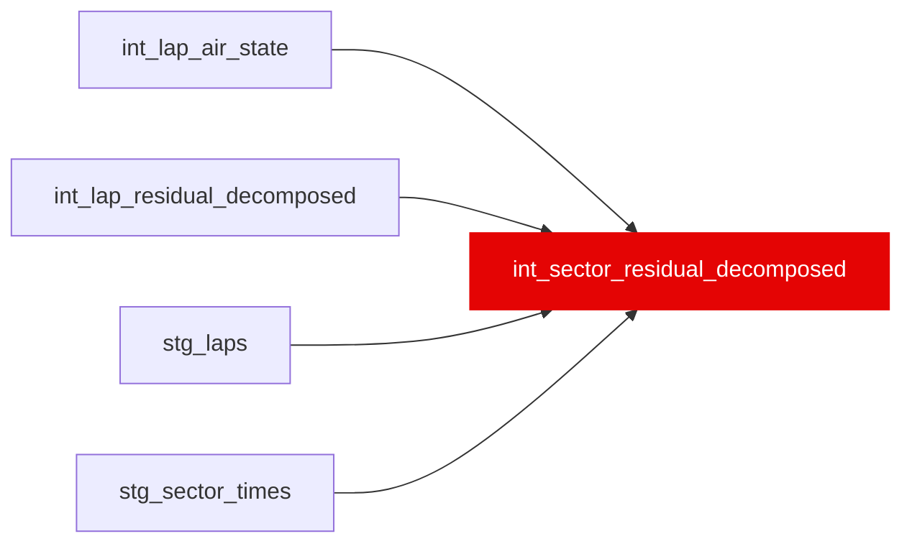

{/* _AUTOGENERATED   do not hand-edit. Run `python scripts/gen_dbt_reference.py` to regenerate. */}

<Note>Part of the [Residual](/transform/families/residual) family.</Note>

One row per lap per sector (3 rows/lap). Breaks down lap-level physics components (fuel, compound, rubber, ambient, constructor, dirty_air) to individual sectors proportional to sector time. Grain: (lap_id, sector). Allows per-sector skill analysis. Matches stg_sector_times granularity. Identity: sector_pace_delta = sector_components + sector_skill_residual.

## Lineage

## Overview

| Property | Value |
|---|---|
| Layer | `intermediate` |
| Family | [Residual](/transform/families/residual) |
| Contract enforced | No |
| Tags | `feature_engineering` |
| Upstream | [`stg_sector_times`](../stg/stg_sector_times), [`stg_laps`](../stg/stg_laps), [`int_lap_residual_decomposed`](./int_lap_residual_decomposed), [`int_lap_air_state`](./int_lap_air_state) |

**11 tests** [guard](/transform/ci/overview) this model  -  10 generic, 1 singular.

## Columns

| Column | Type | Nullable | Tests | Description |
|---|---|---|---|---|
| `sector_id` |   | Yes | [`not_null`](/transform/ci/structural), [`unique`](/transform/ci/structural) | PK = lap_id \|\| '_S' \|\| sector. Matches stg_sector_times convention. |
| `lap_id` |   | Yes | [`not_null`](/transform/ci/structural) | FK to stg_laps |
| `sector` |   | Yes | [`not_null`](/transform/ci/structural), [`accepted_values`](/transform/ci/range-and-domain) | Sector number (1, 2, or 3) |
| `sector_time_s` |   | Yes | [`not_null`](/transform/ci/structural) | Raw sector time in seconds |
| `sector_pace_delta_s` |   | Yes | [`not_null`](/transform/ci/structural) | sector_time_s minus rolling ±3 lap field sector median |
| `sector_driver_skill_residual_s` |   | Yes | [`not_null`](/transform/ci/structural) | Closure residual after all 6 allocated components |
| `sector_total_explained_s` |   | Yes | [`not_null`](/transform/ci/structural) | Sum of the 6 allocated components |
| `dominant_component_class` |   | Yes | [`accepted_values`](/transform/ci/range-and-domain) | Component with the largest absolute value among the 6 allocated components. Values: fuel, compound, rubber, ambient, constructor, dirty_air |
