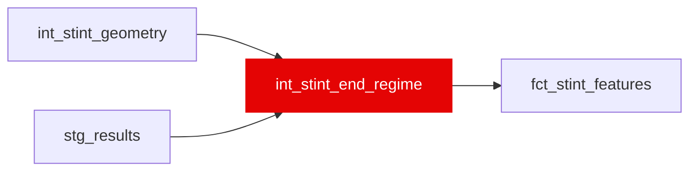

{/* _AUTOGENERATED   do not hand-edit. Run `python scripts/gen_dbt_reference.py` to regenerate. */}

<Note>Part of the [Strategy](/transform/families/strategy) family.</Note>

Why did this stint end? One row per stint. The stint-life survival target treats every uncensored stint as a completed tyre life, but 28.8% of them end under a safety car, VSC or red flag - the moment the pit wall was handed a free stop, not the moment the tyre ran out. This model names the cause so a consumer can separate the tyre-limit process from the interruption process instead of fitting their mixture. It also owns is_censored_stint, which fct_stint_features reads from here, so "the driver's last stint of the race" has one definition. Precedence is declared in the model header: censoring outranks regime, and within an uncensored stint red_flag &gt; safety_car &gt; vsc &gt; green.

## Lineage

## Overview

| Property | Value |
|---|---|
| Layer | `intermediate` |
| Family | [Strategy](/transform/families/strategy) |
| Contract enforced | No |
| Upstream | [`int_stint_geometry`](./int_stint_geometry), [`stg_results`](../stg/stg_results) |

**20 tests** [guard](/transform/ci/overview) this model  -  19 generic, 1 singular.

## Columns

| Column | Type | Nullable | Tests | Description |
|---|---|---|---|---|
| `stint_id` |   | Yes | [`not_null`](/transform/ci/structural), [`unique`](/transform/ci/structural) | PK from int_stint_geometry. One row per stint. |
| `race_year` |   | Yes | [`not_null`](/transform/ci/structural) | Season year. |
| `race_id` |   | Yes | [`not_null`](/transform/ci/structural) | Race identifier (numeric FastF1 event id cast to string). |
| `driver_id` |   | Yes | [`not_null`](/transform/ci/structural) | FastF1 three-letter driver code (e.g. VER, HAM). |
| `stint_number` |   | Yes |   | Stint ordinal within the driver's race. NULL for the 325 stints in 2018 built from laps FastF1 never assigned to a stint; those carry stint_end_cause NULL and end_cause_confidence 'unassigned_stint'. |
| `end_lap_id` |   | Yes | [`not_null`](/transform/ci/structural) | Foreign key to stg_laps - the lap the stint ended on, chronologically. For an uncensored stint this is the in-lap. |
| `end_lap_number` |   | Yes | [`not_null`](/transform/ci/structural) | Race lap number of the stint's final lap. |
| `end_lap_in_stint` |   | Yes | [`not_null`](/transform/ci/structural) | Chronological ordinal of the stint's final lap within the stint (equals stint_length_actual). |
| `is_censored_stint` |   | Yes | [`not_null`](/transform/ci/structural), [`accepted_values`](/transform/ci/range-and-domain) | TRUE when this is the driver's last stint of the race, so it ended at the flag or at retirement rather than at a tyre change. Remaining stint life on these laps is a lower bound, not an observation. Consumed by the stint-life survival model (ml/src/features.py) to set the AFT upper bound to +inf, and by the blind-test scoreboard to report censored and uncensored stints apart. Never a model feature. |
| `end_regime` |   | Yes | [`not_null`](/transform/ci/structural), [`accepted_values`](/transform/ci/range-and-domain) | Track regime in force on the stint's final lap, for every stint including censored ones. Severity precedence red_flag &gt; safety_car &gt; vsc &gt; green, because one TrackStatus string can carry several codes at once. Crossed with is_censored_stint this reproduces the measured end-regime decomposition. |
| `is_multi_regime_end` |   | Yes | [`not_null`](/transform/ci/structural) | TRUE when the final lap carried more than one of red/SC/VSC, so severity precedence had to choose which one names the ending. |
| `ended_on_pit_lap` |   | Yes | [`not_null`](/transform/ci/structural) | TRUE when the stint's final lap carries a pit marker. FALSE on an uncensored stint means the tyre change is known from the existence of a later stint but is not visible on the lap itself. |
| `was_running_at_flag` |   | Yes | [`not_null`](/transform/ci/structural) | TRUE when the driver's classified status says the car was still circulating at the chequered flag ('Finished', '+N Lap(s)', 'Lapped'). Disqualification is resolved on distance instead, because it is a post-race ruling rather than a reason a stint ended. Only meaningful on a censored stint. |
| `stint_end_cause` |   | Yes | [`not_null`](/transform/ci/structural), [`accepted_values`](/transform/ci/range-and-domain) | Six-class answer to "why did this stint end": green_pit, sc_pit, vsc_pit, red for the four uncensored causes, race_end and retirement for the two censored ones. NULL where stint_number is NULL - the row is an artefact of unassigned laps, not a stint that ended. |
| `end_cause_confidence` |   | Yes | [`not_null`](/transform/ci/structural), [`accepted_values`](/transform/ci/range-and-domain) | How confidently the cause is known. 'observed' where every input was read; 'inferred' where severity precedence had to choose, where the pit marker is missing on an uncensored stint, or where disqualification hides whether the driver was running; 'unassigned_stint' where the row is not a stint. |
