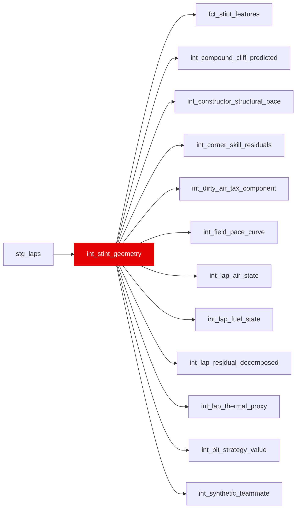

{/* _AUTOGENERATED   do not hand-edit. Run `python scripts/gen_dbt_reference.py` to regenerate. */}

<Note>Part of the [Physics](/transform/families/physics) family.</Note>

Foundation for all downstream window functions. One row per valid race lap. Builds stint identifiers (stint_id), lap positions within stints (lap_in_stint, age_in_stint), and compound tracking. All Layer 03 window functions partition on stint_id.

## Lineage

## Overview

| Property | Value |
|---|---|
| Layer | `intermediate` |
| Family | [Physics](/transform/families/physics) |
| Contract enforced | No |
| Upstream | [`stg_laps`](../stg/stg_laps) |

**4 tests** [guard](/transform/ci/overview) this model  -  3 generic, 1 singular.

## Columns

| Column | Type | Nullable | Tests | Description |
|---|---|---|---|---|
| `stint_id` |   | Yes | [`not_null`](/transform/ci/structural) | Surrogate key combining race_year, race_id, driver_id, stint_number |
| `lap_id` |   | Yes | [`not_null`](/transform/ci/structural), [`unique`](/transform/ci/structural) | Foreign key to stg_laps |
