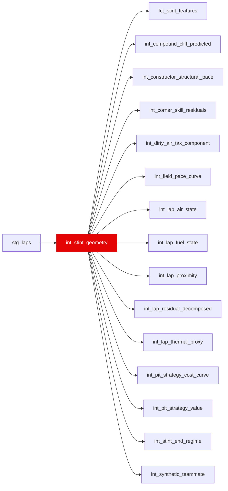

{/* _AUTOGENERATED   do not hand-edit. Run `python scripts/gen_dbt_reference.py` to regenerate. */}

<Note>Part of the [Physics](/transform/families/physics) family.</Note>

Foundation for all downstream window functions. One row per race lap (the FULL chronological sequence, including SC/VSC/pit/invalid laps) so physics-layer LAG/EWMA windows decay correctly across those gaps instead of treating the lap before/after a gap as adjacent. Builds stint identifiers (stint_id), lap positions within stints (lap_in_stint = chronological ordinal, valid_lap_in_stint = ordinal among valid laps only, age_in_stint = tyre_life), and compound tracking. Consumers that fit pace/regression models filter to is_valid_lap (or key off valid_lap_in_stint) at their own input boundary. All Layer 03 window functions partition on stint_id.

## Lineage

## Overview

| Property | Value |
|---|---|
| Layer | `intermediate` |
| Family | [Physics](/transform/families/physics) |
| Contract enforced | No |
| Upstream | [`stg_laps`](../stg/stg_laps) |

**15 tests** [guard](/transform/ci/overview) this model  -  11 generic, 4 singular.

## Columns

| Column | Type | Nullable | Tests | Description |
|---|---|---|---|---|
| `stint_id` |   | Yes | [`not_null`](/transform/ci/structural) | Surrogate key combining race_year, race_id, driver_id, stint_number |
| `lap_id` |   | Yes | [`not_null`](/transform/ci/structural), [`unique`](/transform/ci/structural) | Foreign key to stg_laps |
| `lap_in_stint` |   | Yes | [`not_null`](/transform/ci/structural) | Chronological ordinal within the stint (1, 2, 3, ...), counting every lap including SC/VSC/pit/invalid ones. |
| `valid_lap_in_stint` |   | Yes |   | Ordinal among valid laps only within the stint (NULL on invalid laps). Use for pace-fitting position/length logic instead of lap_in_stint. |
| `stint_length_actual` |   | Yes | [`not_null`](/transform/ci/structural) | Total lap count in the stint (valid + invalid). |
| `stint_length_valid` |   | Yes |   | Count of valid laps in the stint. |
| `is_valid_lap` |   | Yes | [`not_null`](/transform/ci/structural) | Carried through from stg_laps. Timed, on-track, not deleted, accurate, not lap 1, no SC/VSC. |
| `is_pit_lap` |   | Yes | [`not_null`](/transform/ci/structural) | Carried through from stg_laps. TRUE for the out-lap/in-lap of a pit stop. |
| `is_safety_car_lap` |   | Yes | [`not_null`](/transform/ci/structural) | Carried through from stg_laps. TRUE when the TrackStatus string contains a 4 (full SC). |
| `is_vsc_lap` |   | Yes | [`not_null`](/transform/ci/structural) | Carried through from stg_laps. TRUE when the TrackStatus string contains a 6 or 7 (VSC). |
| `is_red_flag_lap` |   | Yes | [`not_null`](/transform/ci/structural) | Carried through from stg_laps. TRUE when the TrackStatus string contains a 5 (red flag). |
| `age_in_stint` |   | Yes | [`expect_column_values_to_be_between`](/transform/ci/range-and-domain) | Tyre age in laps at this lap. Directly from FastF1 TyreLife (no imputation, no reconstruction). 343 rows (0.21%) carry NULL: 325 of them (94.8%) sit on lap 1 of a stint, where tyre-life occasionally arrives without a reading. This is a pattern, not random scatter, and occurs at the exact position where starting_tyre_age_laps is derived. For stints opening on lap 1: if age_in_stint is NULL at the stint start and you need a starting age, the column is missing; do not assume the tyre is fresh (a used/scrubbed set starting a stint will have age_in_stint &gt; 1 or NULL, but never 0). Consumers should carry this column forward or declare how NULLs are handled. |
| `compound_code` |   | Yes |   | Tyre compound code (HARD, MEDIUM, SOFT, INTERMEDIATE, WET, SUPERSOFT, ULTRASOFT, HYPERSOFT). Joined from dim_compounds_season, which carries physical parameters (grip, wear rate) keyed on (season, circuit, compound_code). |
| `compound_label` |   | Yes |   | Tyre compound label (hard, medium, soft) assigned by Pirelli for this race. Relative to the circuit - Pirelli picks 3 compounds per weekend and calls them hard/medium/soft, so "soft" at one circuit is not the same rubber as "soft" at another. The compound_code is the absolute identifier; this label is the relative one. |
| `race_year` |   | Yes |   | Season year. |
| `race_id` |   | Yes |   | Race identifier. |
| `driver_id` |   | Yes |   | FastF1 three-letter driver code (e.g. VER, HAM). |
