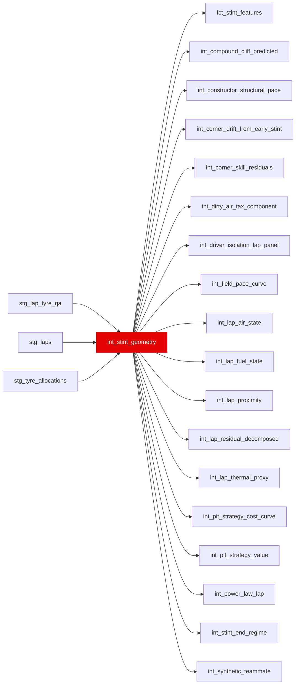

{/* _AUTOGENERATED   do not hand-edit. Run `python scripts/gen_dbt_reference.py` to regenerate. */}

<Note>Part of the [Physics](/transform/families/physics) family.</Note>

Foundation for all downstream window functions. One row per race lap (the FULL chronological sequence, including SC/VSC/pit/invalid laps) so physics-layer LAG/EWMA windows decay correctly across those gaps instead of treating the lap before/after a gap as adjacent. Builds stint identifiers (stint_id), lap positions within stints (lap_in_stint = chronological ordinal, valid_lap_in_stint = ordinal among valid laps only, age_in_stint = tyre_life), and compound tracking. Consumers that fit pace/regression models filter to is_valid_lap (or key off valid_lap_in_stint) at their own input boundary. All Layer 03 window functions partition on stint_id.

## Lineage

```mermaid
flowchart LR
  stg_lap_tyre_qa --> int_stint_geometry
  stg_laps --> int_stint_geometry
  stg_tyre_allocations --> int_stint_geometry
  int_stint_geometry --> fct_stint_features
  int_stint_geometry --> int_compound_cliff_predicted
  int_stint_geometry --> int_constructor_structural_pace
  int_stint_geometry --> int_corner_drift_from_early_stint
  int_stint_geometry --> int_corner_skill_residuals
  int_stint_geometry --> int_dirty_air_tax_component
  int_stint_geometry --> int_driver_isolation_lap_panel
  int_stint_geometry --> int_field_pace_curve
  int_stint_geometry --> int_lap_air_state
  int_stint_geometry --> int_lap_fuel_state
  int_stint_geometry --> int_lap_proximity
  int_stint_geometry --> int_lap_residual_decomposed
  int_stint_geometry --> int_lap_thermal_proxy
  int_stint_geometry --> int_pit_strategy_cost_curve
  int_stint_geometry --> int_pit_strategy_value
  int_stint_geometry --> int_power_law_lap
  int_stint_geometry --> int_stint_end_regime
  int_stint_geometry --> int_synthetic_teammate
  style int_stint_geometry fill:#e40404,stroke:#e40404,color:#fff
```

## Overview

| Property | Value |
|---|---|
| Layer | `intermediate` |
| Family | [Physics](/transform/families/physics) |
| Contract enforced | No |
| Upstream | [`stg_laps`](../stg/stg_laps), [`stg_lap_tyre_qa`](../stg/stg_lap_tyre_qa), [`stg_tyre_allocations`](../stg/stg_tyre_allocations) |

**24 tests** [guard](/transform/ci/overview) this model  -  12 generic, 12 singular.

## Columns

| Column | Type | Nullable | Tests | Description |
|---|---|---|---|---|
| `stint_id` |   | Yes | [`not_null`](/transform/ci/structural) | Surrogate key combining race_year, race_id, driver_id, stint_number |
| `lap_id` |   | Yes | [`not_null`](/transform/ci/structural), [`unique`](/transform/ci/structural) | Foreign key to stg_laps |
| `lap_in_stint` |   | Yes | [`not_null`](/transform/ci/structural) | Chronological ordinal within the stint (1, 2, 3, ...), counting every lap including SC/VSC/pit/invalid ones. |
| `valid_lap_in_stint` |   | Yes |   | Ordinal among valid laps only within the stint (NULL on invalid laps). Use for pace-fitting position/length logic instead of lap_in_stint. |
| `stint_length_actual` |   | Yes | [`not_null`](/transform/ci/structural) | Total lap count in the stint (valid + invalid). |
| `stint_length_valid` |   | Yes |   | Count of valid laps in the stint. |
| `is_valid_lap` |   | Yes | [`not_null`](/transform/ci/structural) | Carried through from stg_laps. Timed, on-track, not deleted, accurate, not lap 1, no SC/VSC. |
| `is_pit_lap` |   | Yes | [`not_null`](/transform/ci/structural) | Carried through from stg_laps. TRUE for the out-lap/in-lap of a pit stop. |
| `is_safety_car_lap` |   | Yes | [`not_null`](/transform/ci/structural) | Carried through from stg_laps. TRUE when the TrackStatus string contains a 4 (full SC). |
| `is_vsc_lap` |   | Yes | [`not_null`](/transform/ci/structural) | Carried through from stg_laps. TRUE when the TrackStatus string contains a 6 or 7 (VSC). |
| `is_red_flag_lap` |   | Yes | [`not_null`](/transform/ci/structural) | Carried through from stg_laps. TRUE when the TrackStatus string contains a 5 (red flag). |
| `stint_source` |   | Yes |   | Where stint_number came from (stg_lap_tyre_qa): 'bronze', 'bronze_lap1_repaired' (the F25 lap-1 gap filled, TyreLife offset) or 'pit_record' (quarantined, F24). |
| `tyre_qa_status` |   | Yes | [`not_null`](/transform/ci/structural) | Bronze tyre-feed verdict from the pit-record cross-check (stg_lap_tyre_qa): 'ok', 'quarantined_race' or 'quarantined_driver'. Quarantined laps carry the pit record's stint ordinal and NULL compound_in_stint / age_in_stint. |
| `age_in_stint` |   | Yes | [`expect_column_values_to_be_between`](/transform/ci/range-and-domain) | Tyre age in laps at this lap: FastF1 TyreLife after stg_lap_tyre_qa (WI-05). Two changes from raw bronze. F25: where bronze left a driver's first one or two laps with no stint (17 of 21 2018 races), those laps join the first stint and its TyreLife -- counted by bronze from the first assigned lap -- is offset by the laps filled. F24: in a quarantined race or driver-race (tyre_qa_status &lt;&gt; 'ok') bronze's tyre data contradicts the pit record, so age is NULL there rather than served, and the row leaves training (is_training_eligible needs age_in_stint &gt; 3). Otherwise NULL only where bronze has no reading; do not assume a NULL-age tyre is fresh (a used/scrubbed set starting a stint will have age_in_stint &gt; 1 or NULL, but never 0). Consumers should carry this column forward or declare how NULLs are handled. |
| `compound_code` |   | Yes |   | Tyre compound code (C1-C5) nominated by Pirelli for this race. The ABSOLUTE identifier, unlike compound_in_stint which is relative - Pirelli picks 3 of 5 physical compounds per weekend and calls them hard/medium/soft, so "SOFT" at one circuit is not the same rubber as "SOFT" at another. Enables cross-circuit compound comparison and physical-parameter lookup in dim_compounds_season. JOIN PATH (08p, corrected 2026-09-22): stg_tyre_allocations on (race_year, race_to_track.track_id, LOWER(compound)). NOT on this model's own upstream `circuit_key` - stg_laps.circuit_key is CAST(race_id AS VARCHAR), a RACE key like '2024_24', while stg_tyre_allocations.circuit_key is a circuit slug like 'abu_dhabi_grand_prix'. The domains are disjoint; joining them directly matches zero rows and fails silently. That is exactly the bug 08p found and fixed, and the reason the resolution goes through the race_to_track seed as the mart's does. NULL RULES, both by construction, neither a sourcing gap: (1) ALL of 2018 is NULL. Pirelli's relative hard/medium/soft naming begins in 2019 and 08d's seed covers 2019-2024 only; 2018's HYPERSOFT/SUPERSOFT/ULTRASOFT are dim_compounds_season's own compound_code, out of scope here. Pinned by tests/assert_stint_geometry_2018_compound_code_null.sql. This is a SEASON-SHAPED missingness pattern - the same shape 02b measured as NOT label-neutral - so a consumer must DECLARE its handling rather than COALESCE it away. (2) INTERMEDIATE and WET laps are NULL in every season (7,750 + 489 rows 2019-2024). Cinturato wets are not on the C1-C5 slick scale at all. Every slick (HARD/MEDIUM/SOFT) lap in 2019-2024 resolves: 132,113 of 132,113, 100.000%. Per-season all-lap coverage runs 91.67%-96.84%; the shortfall is wet-weather rows only. Do not quote the all-lap figure where the slick figure is meant - they are different populations. PROVENANCE - READ BEFORE QUOTING. The underlying seed is USER-ATTESTED (2026-09-17, full correctness of the 128-row mapping across 2019-2024), NOT archivally sourced: only 47 of 128 source_url values resolve, the other 81 are 404 against a press site that no longer serves its pre-2025 archive. 08p's ruling (2026-09-22) admits the table into this lineage as a declared-`assumed` input, MART-ONLY, on the 2026-09-10 decision's own terms - it bars QUOTATION, not USE. This column is deliberately NOT in FEATURE_COLUMNS. Nothing published may rest on it until 08d's archival re-source lands. See _improvements/work/08-foundations-repair.md (08d, 08p). |
| `race_year` |   | Yes |   | Season year. |
| `race_id` |   | Yes |   | Race identifier. |
| `driver_id` |   | Yes |   | FastF1 three-letter driver code (e.g. VER, HAM). |
