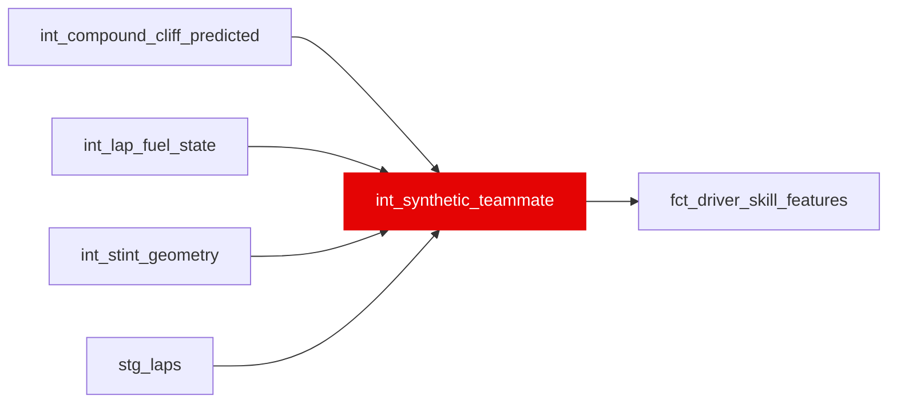

{/* _AUTOGENERATED   do not hand-edit. Run `python scripts/gen_dbt_reference.py` to regenerate. */}

<Note>Part of the [Skill](/transform/families/skill) family.</Note>

Synthetic teammate for driver skill extraction. Grain is (race_year, race_id, ego_driver_id, lap_number). Uses closest-match teammate with same car to create a counterfactual for what the driver would have done in the same equipment if conditions matched.

## Lineage

## Overview

| Property | Value |
|---|---|
| Layer | `intermediate` |
| Family | [Skill](/transform/families/skill) |
| Contract enforced | No |
| Upstream | [`int_lap_fuel_state`](./int_lap_fuel_state), [`int_stint_geometry`](./int_stint_geometry), [`int_compound_cliff_predicted`](./int_compound_cliff_predicted), [`stg_laps`](../stg/stg_laps) |

**5 tests** [guard](/transform/ci/overview) this model  -  4 generic, 1 singular.

## Columns

| Column | Type | Nullable | Tests | Description |
|---|---|---|---|---|
| `race_year` |   | Yes | [`not_null`](/transform/ci/structural) | Race year |
| `race_id` |   | Yes | [`not_null`](/transform/ci/structural) | Race identifier |
| `ego_driver_id` |   | Yes | [`not_null`](/transform/ci/structural) | The driver for whom we synthesize a teammate |
| `lap_number` |   | Yes | [`not_null`](/transform/ci/structural) | Lap number within race |
