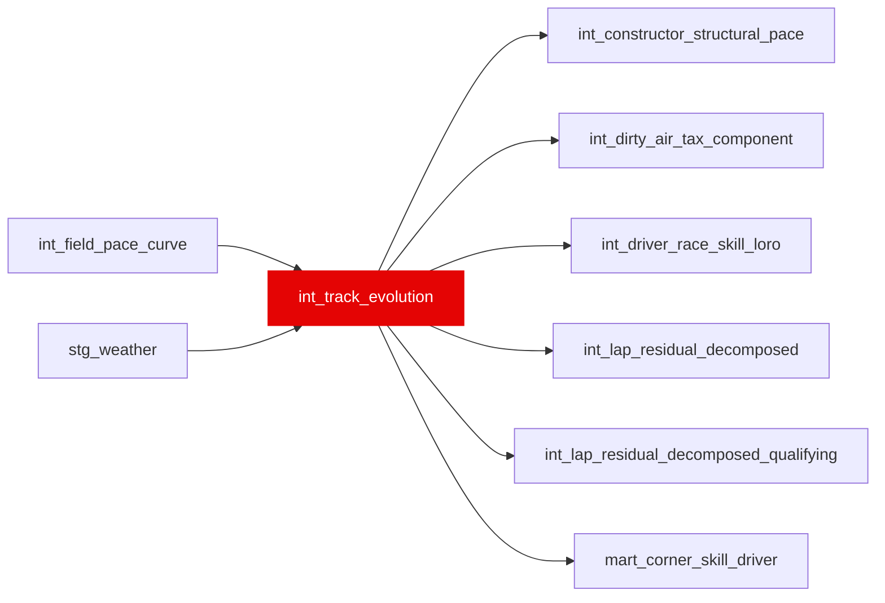

{/* _AUTOGENERATED   do not hand-edit. Run `python scripts/gen_dbt_reference.py` to regenerate. */}

<Note>Part of the [Pace Baselines](/transform/families/pace-baselines) family.</Note>

Track temperature and grip evolution over race. Grain is (race_year, race_id, lap_number). Tracks ambient and track surface temperature, and grip envelope changes over the race due to rubber lay-down and fuel load shedding.

## Lineage

## Overview

| Property | Value |
|---|---|
| Layer | `intermediate` |
| Family | [Pace Baselines](/transform/families/pace-baselines) |
| Contract enforced | No |
| Upstream | [`int_field_pace_curve`](./int_field_pace_curve), [`stg_weather`](../stg/stg_weather) |

**4 tests** [guard](/transform/ci/overview) this model  -  3 generic, 1 singular.

## Columns

| Column | Type | Nullable | Tests | Description |
|---|---|---|---|---|
| `race_year` |   | Yes | [`not_null`](/transform/ci/structural) | Race year |
| `race_id` |   | Yes | [`not_null`](/transform/ci/structural) | Race identifier |
| `lap_number` |   | Yes | [`not_null`](/transform/ci/structural) | Lap number within race |
