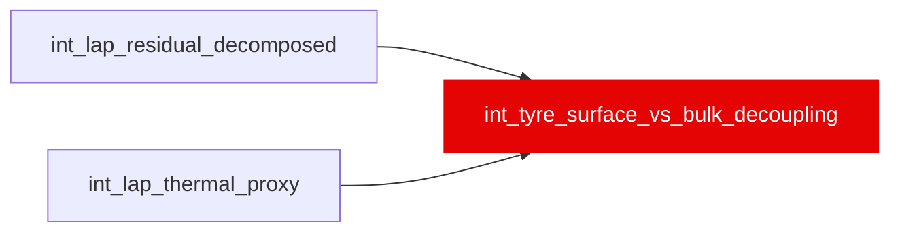

{/* _AUTOGENERATED   do not hand-edit. Run `python scripts/gen_dbt_reference.py` to regenerate. */}

<Note>Part of the [Residual](/transform/families/residual) family.</Note>

One row per lap (post-cliff only). After tyre cliff, diagnoses whether degradation is surface-recoverable or bulk-structural. surface_bulk_ratio [0, 0.606], 0.5 at steady push: high = recoverable, low = must pit. Includes recovery_probability (pace-recovery chance within 2 laps). Grain: lap_id filtered to cliff_onset_passed = TRUE.

## Lineage

## Overview

| Property | Value |
|---|---|
| Layer | `intermediate` |
| Family | [Residual](/transform/families/residual) |
| Contract enforced | No |
| Tags | `simulation`, `thermal` |
| Upstream | [`int_lap_thermal_proxy`](./int_lap_thermal_proxy), [`int_lap_residual_decomposed`](./int_lap_residual_decomposed) |

**10 tests** [guard](/transform/ci/overview) this model  -  9 generic, 1 singular.

## Columns

| Column | Type | Nullable | Tests | Description |
|---|---|---|---|---|
| `lap_id` |   | Yes | [`not_null`](/transform/ci/structural), [`unique`](/transform/ci/structural) | PK, FK to stg_laps (post-cliff laps only) |
| `surface_bulk_ratio` |   | Yes | [`not_null`](/transform/ci/structural), [`expect_column_values_to_be_between`](/transform/ci/range-and-domain) | Surface share of the two thermal loads, each divided by its own weight sum (vars thermal_surface_weight_sum / thermal_bulk_weight_sum): 0.5 at steady push. F49 (WI-15b): surface &lt;= bulk by construction, so the ceiling is bulk_sum/(surface_sum+bulk_sum) = 0.606 (all push on the current lap); the bound below is that ceiling, not [0, 1]. Before F49 the unnormalised share was capped at 0.5. |
| `degradation_source` |   | Yes | [`not_null`](/transform/ci/structural), [`accepted_values`](/transform/ci/range-and-domain) | bulk_driven when surface_bulk_ratio &lt; 0.35, else mixed. F49 (WI-15b) removed surface_driven (&gt; 0.65), which the ratio's 0.606 ceiling made unreachable. T39 (assert_degradation_source_classes_reachable) checks every value below has rows. |
| `recovery_probability` |   | Yes | [`not_null`](/transform/ci/structural), [`expect_column_values_to_be_between`](/transform/ci/range-and-domain) | Probability of pace recovery within 2 laps. [0, 1]. SQL approximation. |
| `thermal_attribution_s` |   | Yes | [`not_null`](/transform/ci/structural) | Share of compound_component_s attributable to thermal (surface) damage. |
