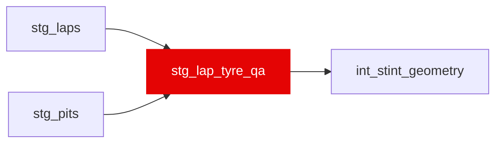

{/* _AUTOGENERATED   do not hand-edit. Run `python scripts/gen_dbt_reference.py` to regenerate. */}

<Note>Part of the [Staging](/transform/families/staging) family.</Note>

Bronze tyre QA (WI-05: F24, F25), one row per race lap; int_stint_geometry reads stint_number / tyre_life / compound from here instead of raw bronze. (1) F25 repair: a driver's first unassigned laps (&lt;= var('tyre_qa_max_unassigned_leading_laps'), the 2018 lap-1 gap) join the first stint, and that stint's TyreLife is offset by the laps filled, since bronze counted it from the first assigned lap; laps up to a stop taken inside the gap are the stint before, with unknown tyres. (2) F24 cross-check: every race's stint numbering is compared with stg_pits. A race is quarantined when it has &gt;= var('tyre_qa_race_unexplained_boundaries_min') stint changes with no in-lap in the var('tyre_qa_boundary_window_laps') laps before them (and no red flag) or whose in-lap an earlier change already claimed (one stop, one change), or when &gt;= var('tyre_qa_race_unmatched_pit_share_min') of its racing stops (&gt;= 3) have no stint change after them; outside those races a driver-race is quarantined on any such unexplained change or on laps bronze never assigned. A quarantined unit serves the pit record's stint ordinal and NULL compound / tyre_life, never a boundary that contradicts the pit record. As built on the 2018-2025 warehouse the quarantined races are 2018_3, 2022_7, 2022_11 and 2025_6 (see tyre_qa_status).

## Lineage

## Overview

| Property | Value |
|---|---|
| Layer | `staging` |
| Family | [Staging](/transform/families/staging) |
| Contract enforced | No |
| Upstream | [`stg_laps`](./stg_laps), [`stg_pits`](./stg_pits) |

**5 tests** [guard](/transform/ci/overview) this model  -  5 generic, 0 singular.

## Columns

| Column | Type | Nullable | Tests | Description |
|---|---|---|---|---|
| `lap_id` | `varchar` | Yes | [`not_null`](/transform/ci/structural), [`unique`](/transform/ci/structural) | Foreign key to stg_laps. |
| `stint_number` | `integer` | Yes |   | Served stint number: bronze (lap-1 gap filled) where tyre_qa_status = 'ok', else the pit record's ordinal (1 + stops the car exited from before the lap + bronze's red-flag stint changes). NULL only for the few driver-races bronze never assigned any stint to (two cars retired on laps 1-2 in 2018). |
| `tyre_life` | `integer` | Yes |   | Served tyre age (laps on the set, bronze TyreLife): offset by the filled laps on a repaired first stint; NULL when quarantined. |
| `compound` | `varchar` | Yes |   | Served compound (bronze); NULL when quarantined. |
| `stint_source` | `varchar` | Yes | [`accepted_values`](/transform/ci/range-and-domain) | Where stint_number came from. |
| `tyre_life_offset_laps` | `integer` | Yes |   | Laps added to bronze TyreLife by the F25 repair (0, 1 or 2). |
| `tyre_qa_status` | `varchar` | Yes | [`not_null`](/transform/ci/structural), [`accepted_values`](/transform/ci/range-and-domain) | The quarantine list. 'ok' serves bronze; the other two serve the pit record. |
| `n_unexplained_stint_changes` | `bigint` | Yes |   | Race-level count of bronze stint changes with no in-lap in the window before and no red flag. |
| `n_racing_stops` | `bigint` | Yes |   | Race-level count of stops the car rejoined from and ran 3+ more laps after, no red flag. |
| `n_unmatched_racing_stops` | `bigint` | Yes |   | Racing stops with no bronze stint change in the window after them. |
| `is_unexplained_stint_change` | `boolean` | Yes |   | TRUE on a lap where bronze starts a stint the pit record cannot explain. |
| `bronze_stint_number` | `integer` | Yes |   | Bronze Stint, as ingested. |
| `bronze_tyre_life` | `integer` | Yes |   | Bronze TyreLife, as ingested. |
| `bronze_compound` | `varchar` | Yes |   | Bronze compound (normalised in stg_laps), as ingested. |
