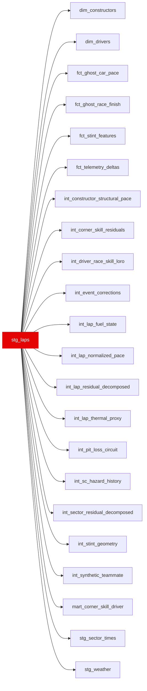

{/* _AUTOGENERATED   do not hand-edit. Run `python scripts/gen_dbt_reference.py` to regenerate. */}

<Note>Part of the [Staging](/transform/families/staging) family.</Note>

Cleaned lap-level data from FastF1 race sessions. One row per driver × lap. Renames Bronze columns to snake_case, casts nanosecond timings to seconds, and derives the validity / track-status flags consumed across the warehouse. is_valid_lap = TRUE excludes pit laps, deleted laps, SC/VSC laps, and lap 1.

## Lineage

## Overview

| Property | Value |
|---|---|
| Layer | `staging` |
| Family | [Staging](/transform/families/staging) |
| Contract enforced | No |

**9 tests** [guard](/transform/ci/overview) this model  -  7 generic, 2 singular.

## Columns

| Column | Type | Nullable | Tests | Description |
|---|---|---|---|---|
| `lap_id` | `varchar` | Yes | [`not_null`](/transform/ci/structural), [`unique`](/transform/ci/structural) | Surrogate key   &#123;season&#125;_&#123;race_id&#125;_&#123;driver&#125;_&#123;lap_number&#125;. |
| `race_year` | `integer` | Yes | [`not_null`](/transform/ci/structural) | Season year. |
| `circuit_key` | `varchar` | Yes |   | Event/grand-prix key (equals race_id); used to group laps by circuit. |
| `race_id` | `varchar` | Yes | [`not_null`](/transform/ci/structural) | Numeric FastF1 event id cast to string (e.g. '4'); the join key used across staging, not the human-readable slug. |
| `driver_id` | `varchar` | Yes | [`not_null`](/transform/ci/structural) | FastF1 three-letter driver code (e.g. VER, HAM). |
| `driver_number` | `varchar` | Yes |   | Car number the driver carried in this session. |
| `constructor_id` | `varchar` | Yes |   | Team name as reported by FastF1 (e.g. 'Mercedes'). |
| `lap_number` | `integer` | Yes | [`not_null`](/transform/ci/structural) | Lap index within the race (1-based). |
| `stint_number` | `integer` | Yes |   | Stint index within the race (1-based); increments after each pit stop. |
| `tyre_life` | `integer` | Yes |   | Laps already completed on the current tyre set at the start of this lap. |
| `is_fresh_tyre` | `boolean` | Yes |   | TRUE when the lap began on a freshly fitted tyre set. |
| `is_personal_best` | `boolean` | Yes |   | FastF1 flag   the lap was the driver's personal best at the time it was set. |
| `position` | `integer` | Yes |   | Track position (classification order) at the end of the lap. |
| `lap_time_s` | `double` | Yes |   | Lap time in seconds (Bronze nanoseconds ÷ 1e9); NULL when not timed. |
| `lap_start_time_s` | `double` | Yes |   | Session clock (s) at the start of the lap; used to join weather and air state. |
| `sector1_time_s` | `double` | Yes |   | Sector 1 time in seconds; NULL when missing. |
| `sector2_time_s` | `double` | Yes |   | Sector 2 time in seconds; NULL when missing. |
| `sector3_time_s` | `double` | Yes |   | Sector 3 time in seconds; NULL when missing. |
| `sector1_session_time_s` | `double` | Yes |   | Session clock (s) at the sector 1 split. |
| `sector2_session_time_s` | `double` | Yes |   | Session clock (s) at the sector 2 split. |
| `sector3_session_time_s` | `double` | Yes |   | Session clock (s) at the sector 3 split. |
| `speed_i1_kph` | `double` | Yes |   | Speed-trap reading at intermediate point 1 (kph). |
| `speed_i2_kph` | `double` | Yes |   | Speed-trap reading at intermediate point 2 / sector 2 exit (kph). |
| `speed_fl_kph` | `double` | Yes |   | Speed-trap reading at the finish line (kph). |
| `speed_st_kph` | `double` | Yes |   | Speed-trap reading on the longest straight (kph). |
| `track_status` | `varchar` | Yes |   | Raw FastF1 TrackStatus string for the lap (concatenated digit codes, e.g. '41' = SC+yellow). |
| `is_pit_lap` | `boolean` | Yes |   | TRUE when the lap has a pit-in or pit-out time (an in/out lap). |
| `is_deleted` | `boolean` | Yes |   | TRUE when stewards deleted the lap time (e.g. track-limits breach). |
| `is_accurate` | `boolean` | Yes |   | FastF1 quality flag   timing considered reliable. |
| `is_fastf1_generated` | `boolean` | Yes |   | TRUE when the row was synthesised by FastF1 rather than read from raw timing. |
| `compound` | `varchar` | Yes | [`accepted_values`](/transform/ci/range-and-domain) | Normalised tyre compound label (UPPER). None/nan/UNKNOWN mapped to NULL. Pre-2019 compounds (SUPERSOFT/ULTRASOFT/HYPERSOFT) preserved as-is. |
| `is_safety_car_lap` | `boolean` | Yes |   | TRUE when TrackStatus contains a 4, 6 or 7. Per the corrected FastF1 decode (see stg_track_status), 4 = SC and 6/7 = VSC, so this flag fires for both SC and VSC laps. Use stg_track_status for a precise SC-vs-VSC split. |
| `is_vsc_lap` | `boolean` | Yes |   | TRUE when TrackStatus contains a 5. NOTE: 5 is the red-flag code in the corrected FastF1 decode (stg_track_status), so this column is a known mislabel kept for backwards compatibility   prefer stg_track_status for accurate VSC classification. (is_valid_lap excludes 4–7 regardless.) |
| `is_valid_lap` | `boolean` | Yes |   | Clean-lap flag: timed (lap_time_s &gt; 0), not a pit lap, not deleted, accurate, lap_number &gt; 1, and no SC/VSC/red flag (TrackStatus contains no 4–7). |
