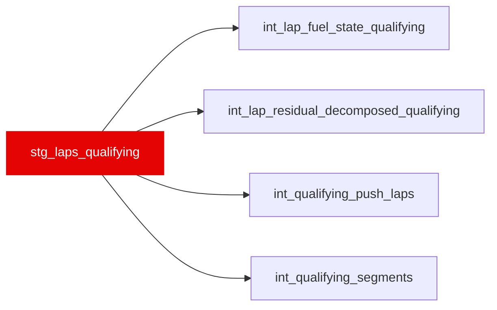

{/* _AUTOGENERATED   do not hand-edit. Run `python scripts/gen_dbt_reference.py` to regenerate. */}

<Note>Part of the [Staging](/transform/families/staging) family.</Note>

Cleaned qualifying lap data (Q1/Q2/Q3), mirroring stg_laps for qualifying sessions. One row per driver × lap. Same Bronze→snake_case rename, nanosecond→second casts, and validity flags as stg_laps, with an added session_type = 'Q' marker. Feeds the qualifying decomposition branch (int_*_qualifying models).

## Lineage

## Overview

| Property | Value |
|---|---|
| Layer | `staging` |
| Family | [Staging](/transform/families/staging) |
| Contract enforced | No |

**10 tests** [guard](/transform/ci/overview) this model  -  9 generic, 1 singular.

## Columns

| Column | Type | Nullable | Tests | Description |
|---|---|---|---|---|
| `lap_id` | `varchar` | Yes | [`not_null`](/transform/ci/structural), [`unique`](/transform/ci/structural) | Surrogate key   &#123;season&#125;_&#123;race_id&#125;_Q_&#123;driver&#125;_&#123;lap_number&#125;. |
| `race_year` | `integer` | Yes | [`not_null`](/transform/ci/structural) | Season year. |
| `circuit_key` | `varchar` | Yes |   | Event/grand-prix key (equals race_id); groups laps by circuit. |
| `race_id` | `varchar` | Yes | [`not_null`](/transform/ci/structural) | Numeric FastF1 event id cast to string; matches stg_laps.race_id. |
| `session_type` | `varchar` | Yes |   | Constant 'Q' marking the qualifying session. |
| `driver_id` | `varchar` | Yes | [`not_null`](/transform/ci/structural) | FastF1 three-letter driver code (e.g. VER, HAM). |
| `driver_number` | `varchar` | Yes |   | Car number the driver carried in this session. |
| `constructor_id` | `varchar` | Yes |   | Team name as reported by FastF1. |
| `lap_number` | `integer` | Yes | [`not_null`](/transform/ci/structural) | Lap index within the qualifying session (1-based). |
| `stint_number` | `integer` | Yes |   | Stint (run) index within qualifying. |
| `tyre_life` | `integer` | Yes |   | Laps already completed on the current tyre set at the start of this lap. |
| `is_fresh_tyre` | `boolean` | Yes |   | TRUE when the lap began on a freshly fitted tyre set. |
| `is_personal_best` | `boolean` | Yes |   | FastF1 flag   the lap was the driver's personal best at the time it was set. |
| `position` | `integer` | Yes |   | Provisional classification at the time of the lap. |
| `lap_time_s` | `double` | Yes |   | Lap time in seconds; NULL when not timed. |
| `lap_start_time_s` | `double` | Yes |   | Session clock (s) at the start of the lap. |
| `sector1_time_s` | `double` | Yes |   | Sector 1 time in seconds. |
| `sector2_time_s` | `double` | Yes |   | Sector 2 time in seconds. |
| `sector3_time_s` | `double` | Yes |   | Sector 3 time in seconds. |
| `sector1_session_time_s` | `double` | Yes |   | Session clock (s) at the sector 1 split. |
| `sector2_session_time_s` | `double` | Yes |   | Session clock (s) at the sector 2 split. |
| `sector3_session_time_s` | `double` | Yes |   | Session clock (s) at the sector 3 split. |
| `speed_i1_kph` | `double` | Yes |   | Speed-trap reading at intermediate point 1 (kph). |
| `speed_i2_kph` | `double` | Yes |   | Speed-trap reading at intermediate point 2 (kph). |
| `speed_fl_kph` | `double` | Yes |   | Speed-trap reading at the finish line (kph). |
| `speed_st_kph` | `double` | Yes |   | Speed-trap reading on the longest straight (kph). |
| `track_status` | `varchar` | Yes |   | Raw FastF1 TrackStatus string for the lap. |
| `is_pit_lap` | `boolean` | Yes |   | TRUE when the lap has a pit-in or pit-out time. |
| `is_deleted` | `boolean` | Yes |   | TRUE when stewards deleted the lap time (e.g. track limits). |
| `is_accurate` | `boolean` | Yes |   | FastF1 quality flag   timing considered reliable. |
| `is_fastf1_generated` | `boolean` | Yes |   | TRUE when the row was synthesised by FastF1. |
| `compound` | `varchar` | Yes |   | Normalised tyre compound (UPPER); None/nan/UNKNOWN mapped to NULL. |
| `is_safety_car_lap` | `boolean` | Yes | [`not_null`](/transform/ci/structural) | TRUE when TrackStatus contains a 4 (SCDeployed). See stg_laps for the full decode. |
| `is_vsc_lap` | `boolean` | Yes | [`not_null`](/transform/ci/structural) | TRUE when TrackStatus contains a 6 or 7 (VSCDeployed/VSCEnding). |
| `is_red_flag_lap` | `boolean` | Yes | [`not_null`](/transform/ci/structural) | TRUE when TrackStatus contains a 5 (Red) — a full session stoppage. |
| `is_valid_lap` | `boolean` | Yes |   | Clean-lap flag (timed, not pit/deleted, accurate, no SC/VSC, lap_number &gt; 1). |
