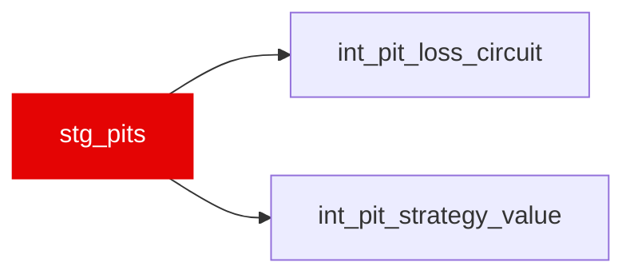

{/* _AUTOGENERATED   do not hand-edit. Run `python scripts/gen_dbt_reference.py` to regenerate. */}

<Note>Part of the [Staging](/transform/families/staging) family.</Note>

One row per pit stop: a lap carrying PitInTime. Bronze splits a stop across two lap rows (PitInTime on the in-lap, PitOutTime on the out-lap), so the exit side is resolved with a LEAD over the driver's own pit laps and out-lap-only rows — including pit-lane race starts — are not emitted as stops. 5,336 stops across 2018–2024.

## Lineage

## Overview

| Property | Value |
|---|---|
| Layer | `staging` |
| Family | [Staging](/transform/families/staging) |
| Contract enforced | No |

**6 tests** [guard](/transform/ci/overview) this model  -  4 generic, 2 singular.

## Columns

| Column | Type | Nullable | Tests | Description |
|---|---|---|---|---|
| `lap_id` | `varchar` | Yes | [`not_null`](/transform/ci/structural), [`unique`](/transform/ci/structural) | Foreign key to stg_laps (the pit-in lap). |
| `race_year` | `integer` | Yes |   | Season year. |
| `race_id` | `varchar` | Yes |   | Numeric FastF1 event id cast to string. |
| `driver_id` | `varchar` | Yes |   | FastF1 three-letter driver code. |
| `pit_in_lap_number` | `integer` | Yes | [`not_null`](/transform/ci/structural) | Lap on which the car entered the pit lane. |
| `pit_out_lap_number` | `integer` | Yes |   | Lap on which the car exited, always pit_in_lap_number + 1 where an out-lap exists. NULL for the 227 stops with no following out-lap (retired in the pit lane, or the race ended under the stop). |
| `stint_number` | `integer` | Yes |   | Stint index of the in-lap, i.e. the stint this stop ends. |
| `compound_in` | `varchar` | Yes |   | Tyre compound removed at this stop (UPPER), read off the in-lap. Bronze reports each lap's own rubber, so this differs from compound_out on 3,844 of 5,109 stops. |
| `compound_out` | `varchar` | Yes |   | Tyre compound fitted on exit (UPPER), read off the out-lap; NULL when there is none. |
| `pit_in_time_s` | `double` | Yes | [`not_null`](/transform/ci/structural) | Session clock (s) at pit entry. |
| `pit_out_time_s` | `double` | Yes |   | Session clock (s) at pit exit, taken from the out-lap row; NULL when there is none. |
| `pit_duration_s` | `double` | Yes |   | pit_out_time_s − pit_in_time_s (seconds): pit entry to pit exit, so it spans the whole pit lane rather than the stationary time alone. Median 23.93 s. Red-flag stoppages and garage returns fall inside the car's pit window and inflate it — 388 of 5,109 exceed 60 s — so consumers wanting a green-flag service time must filter. |
