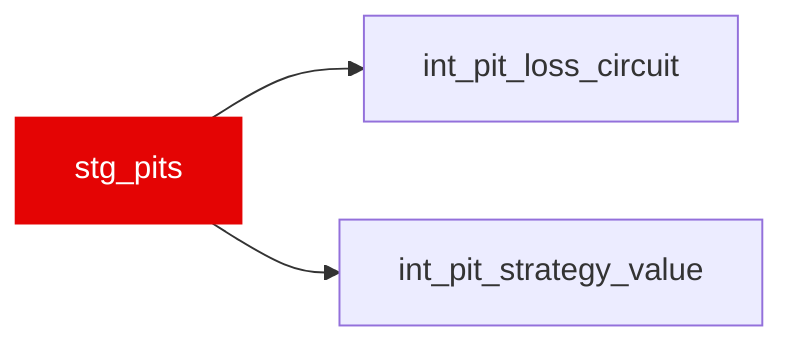

{/* _AUTOGENERATED   do not hand-edit. Run `python scripts/gen_dbt_reference.py` to regenerate. */}

<Note>Part of the [Staging](/transform/families/staging) family.</Note>

One row per pit-stop event, derived from laps with a non-null PitInTime or PitOutTime. pit_in_lap_number is the lap on which the car entered the pit lane; pit_out_lap_number is the (usually next) lap on which it exited. pit_duration_s is NULL when only one of the in/out times is recorded.

## Lineage

## Overview

| Property | Value |
|---|---|
| Layer | `staging` |
| Family | [Staging](/transform/families/staging) |
| Contract enforced | No |

**1 tests** [guard](/transform/ci/overview) this model  -  1 generic, 0 singular.

## Columns

| Column | Type | Nullable | Tests | Description |
|---|---|---|---|---|
| `lap_id` | `varchar` | Yes | [`not_null`](/transform/ci/structural) | Foreign key to stg_laps (the pit-in lap). |
| `race_year` | `integer` | Yes |   | Season year. |
| `race_id` | `varchar` | Yes |   | Numeric FastF1 event id cast to string. |
| `driver_id` | `varchar` | Yes |   | FastF1 three-letter driver code. |
| `pit_in_lap_number` | `integer` | Yes |   | Lap on which the car entered the pit lane. |
| `pit_out_lap_number` | `integer` | Yes |   | Lap on which the car exited the pit lane (pit_in_lap_number + 1). |
| `stint_number` | `integer` | Yes |   | Stint index at the moment of the stop. |
| `compound_out` | `varchar` | Yes |   | Tyre compound fitted on exit (UPPER). |
| `pit_in_time_s` | `double` | Yes |   | Session clock (s) at pit entry; NULL when not recorded. |
| `pit_out_time_s` | `double` | Yes |   | Session clock (s) at pit exit; NULL when not recorded. |
| `pit_duration_s` | `double` | Yes |   | pit_out_time_s − pit_in_time_s (seconds); NULL when either bound is missing. |
