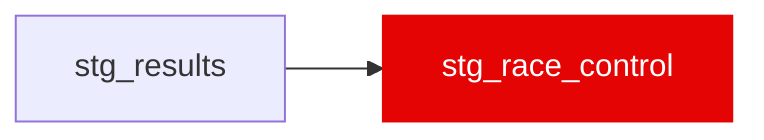

{/* _AUTOGENERATED   do not hand-edit. Run `python scripts/gen_dbt_reference.py` to regenerate. */}

<Note>Part of the [Staging](/transform/families/staging) family.</Note>

The FIA race-control message feed. One row per message; 12,814 rows across 149 races, of which 4,909 are waved blue flags. Ingested since the beginning of the project and consumed by nothing until Phase 10a (plan open item 13, now closed).
Staged for one reason: the blue flags are a traffic label produced by race control rather than by the position channel, which makes them the only supervised check available for the proximity features that is not derived from the same sensor. The car number is resolved to driver_id here so consumers join on the key the rest of the warehouse uses.

## Lineage

## Overview

| Property | Value |
|---|---|
| Layer | `staging` |
| Family | [Staging](/transform/families/staging) |
| Contract enforced | No |
| Upstream | [`stg_results`](./stg_results) |

**3 tests** [guard](/transform/ci/overview) this model  -  2 generic, 1 singular.

## Columns

| Column | Type | Nullable | Tests | Description |
|---|---|---|---|---|
| `race_id` | `varchar` | Yes | [`not_null`](/transform/ci/structural) | Numeric FastF1 event id; matches stg_laps.race_id. |
| `message_time_s` | `double` | Yes |   | Session clock of the message. NOT on the same origin as the telemetry SessionTime column (it runs to ~55,000 s on a two-hour race, i.e. it is a wall-clock derivative). Join on lap_number, not on this. |
| `flag` | `varchar` | Yes |   | Flag colour, upper-cased, NULL for non-flag messages (BLUE / YELLOW / DOUBLE YELLOW / GREEN / CLEAR / RED / CHEQUERED / BLACK AND WHITE). |
| `driver_id` | `varchar` | Yes |   | Three-letter code resolved from RacingNumber via stg_results. NULL where the message is not driver-scoped, or where the number did not resolve. |
| `is_blue_flag_event` | `boolean` | Yes | [`not_null`](/transform/ci/structural) | TRUE when this row is a blue flag whose driver identity and lap both resolved - "this driver was being lapped on this lap". All 4,909 blue flags resolve (verified 2026-09-05). A flag whose number failed to resolve would be a data gap, not a negative, which is why this is a flag and not a filter. |
