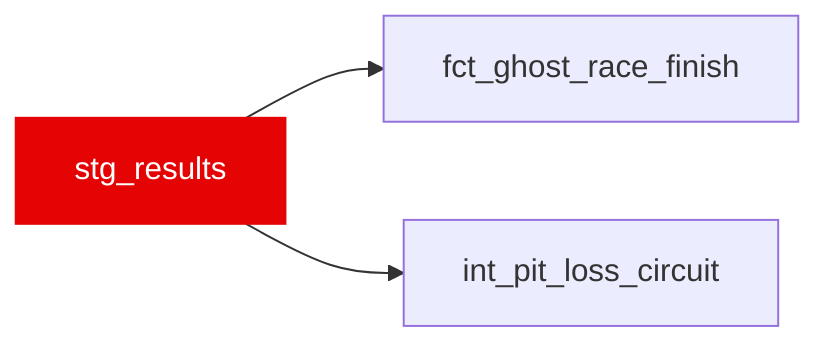

{/* _AUTOGENERATED   do not hand-edit. Run `python scripts/gen_dbt_reference.py` to regenerate. */}

<Note>Part of the [Staging](/transform/families/staging) family.</Note>

Official classified race results from FastF1 session.results. One row per driver × race. Source of truth for finishing position, grid, points, and the explicit DNF / classification split used by fct_ghost_race_finish instead of deriving the finish from MAX(position).

## Lineage

## Overview

| Property | Value |
|---|---|
| Layer | `staging` |
| Family | [Staging](/transform/families/staging) |
| Contract enforced | No |

**8 tests** [guard](/transform/ci/overview) this model  -  8 generic, 0 singular.

## Columns

| Column | Type | Nullable | Tests | Description |
|---|---|---|---|---|
| `result_id` | `varchar` | Yes | [`not_null`](/transform/ci/structural), [`unique`](/transform/ci/structural) | Surrogate key   &#123;race_id&#125;_&#123;driver abbreviation&#125;. |
| `race_year` | `integer` | Yes | [`not_null`](/transform/ci/structural) | Season year. |
| `race_id` | `varchar` | Yes | [`not_null`](/transform/ci/structural) | Numeric FastF1 event id cast to string (e.g. '4'); matches stg_laps.race_id. |
| `race_slug` | `varchar` | Yes |   | Human-readable event name (e.g. azerbaijan_grand_prix). |
| `driver_id` | `varchar` | Yes | [`not_null`](/transform/ci/structural) | FastF1 three-letter driver code. |
| `driver_number` | `varchar` | Yes |   | Car number carried by the driver. |
| `constructor_id` | `varchar` | Yes |   | Team name as reported by FastF1. |
| `finish_position` | `integer` | Yes |   | Numeric finishing position from FastF1. |
| `classified_position` | `varchar` | Yes |   | Raw ClassifiedPosition string ('1'..'20' for ranked finishers; 'R'/'D'/'W'/'E'/'F'/'N' otherwise). |
| `grid_position` | `integer` | Yes |   | Starting grid position. |
| `points` | `double` | Yes |   | Championship points scored in the race. |
| `time_or_gap_s` | `double` | Yes |   | Total race time for the winner / gap to winner for others (seconds); NULL when unavailable. |
| `status` | `varchar` | Yes |   | Raw FastF1 status string ('Finished', '+1 Lap', 'Engine', 'Collision', ...). |
| `is_classified` | `boolean` | Yes | [`not_null`](/transform/ci/structural) | TRUE when ClassifiedPosition parses to an integer (a ranked finisher). |
| `is_dnf` | `boolean` | Yes | [`not_null`](/transform/ci/structural) | TRUE for retirements (not classified and not a lapped finish). |
| `dnf_cause` | `varchar` | Yes | [`accepted_values`](/transform/ci/range-and-domain) | Coarse cause for DNFs only   'racing' / 'mechanical' / 'non_classified'; NULL for finishers. |
