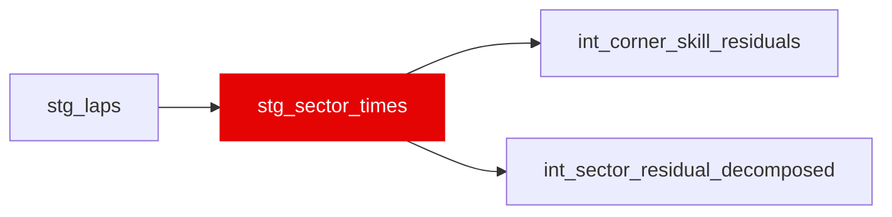

{/* _AUTOGENERATED   do not hand-edit. Run `python scripts/gen_dbt_reference.py` to regenerate. */}

<Note>Part of the [Staging](/transform/families/staging) family.</Note>

Per-sector timing unpivoted from stg_laps. One row per lap × sector (1/2/3). Carries the speed-trap reading associated with each sector exit (S1→I1, S2→I2, S3→FL).

## Lineage

## Overview

| Property | Value |
|---|---|
| Layer | `staging` |
| Family | [Staging](/transform/families/staging) |
| Contract enforced | No |
| Upstream | [`stg_laps`](./stg_laps) |

**4 tests** [guard](/transform/ci/overview) this model  -  4 generic, 0 singular.

## Columns

| Column | Type | Nullable | Tests | Description |
|---|---|---|---|---|
| `sector_id` | `varchar` | Yes | [`not_null`](/transform/ci/structural), [`unique`](/transform/ci/structural) | Surrogate key   &#123;lap_id&#125;_S&#123;sector&#125;. |
| `lap_id` | `varchar` | Yes | [`not_null`](/transform/ci/structural) | Foreign key to stg_laps. |
| `race_year` | `integer` | Yes |   | Season year. |
| `race_id` | `varchar` | Yes |   | Numeric FastF1 event id cast to string. |
| `driver_id` | `varchar` | Yes |   | FastF1 three-letter driver code. |
| `lap_number` | `integer` | Yes |   | Lap index within the race. |
| `sector` | `integer` | Yes | [`accepted_values`](/transform/ci/range-and-domain) | Sector number (1, 2 or 3). |
| `sector_time_s` | `double` | Yes |   | Time spent in the sector (seconds). |
| `sector_session_time_s` | `double` | Yes |   | Session clock (s) at the sector split. |
| `speed_trap_kph` | `double` | Yes |   | Speed-trap reading associated with the sector exit (kph). |
| `is_valid_lap` | `boolean` | Yes |   | Inherited clean-lap flag from the parent lap. |
