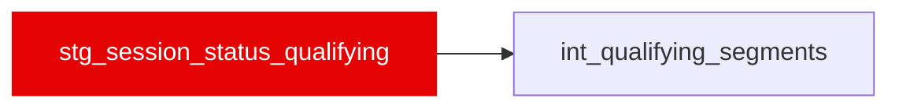

{/* _AUTOGENERATED   do not hand-edit. Run `python scripts/gen_dbt_reference.py` to regenerate. */}

<Note>Part of the [Staging](/transform/families/staging) family.</Note>

Session lifecycle events for the qualifying session, mirroring stg_session_status. This is the only record of where Q1, Q2 and Q3 begin and end   FastF1 reports one flat lap set per Q session with no segment column   so int_qualifying_segments splits the session on the Started / Finished pairs here. 'Aborted' marks a red-flag stoppage inside a segment.

## Lineage

## Overview

| Property | Value |
|---|---|
| Layer | `staging` |
| Family | [Staging](/transform/families/staging) |
| Contract enforced | No |

**4 tests** [guard](/transform/ci/overview) this model  -  4 generic, 0 singular.

## Columns

| Column | Type | Nullable | Tests | Description |
|---|---|---|---|---|
| `session_status_id` | `varchar` | Yes | [`not_null`](/transform/ci/structural) | Surrogate key   &#123;race_id&#125;_Q_&#123;session_time_s&#125;. |
| `race_year` | `integer` | Yes | [`not_null`](/transform/ci/structural) | Season year. |
| `race_id` | `varchar` | Yes | [`not_null`](/transform/ci/structural) | Numeric FastF1 event id cast to string; matches stg_laps_qualifying.race_id. |
| `race_slug` | `varchar` | Yes |   | Human-readable event name. |
| `session_type` | `varchar` | Yes |   | Constant 'Q' marking the qualifying session. |
| `session_time_s` | `double` | Yes | [`not_null`](/transform/ci/structural) | Session clock (s) at the lifecycle event. |
| `status` | `varchar` | Yes |   | Raw FastF1 session status ('Started', 'Aborted', 'Finished', ...). |
| `is_red_flag_stop` | `boolean` | Yes |   | TRUE when status is 'Aborted' (a red-flag stoppage). |
| `is_green_light` | `boolean` | Yes |   | TRUE when status is 'Started'. Raw event, NOT one per segment: a red flag inside a segment is written 'Aborted' and the resumption is another 'Started'. |
| `is_chequered_flag` | `boolean` | Yes |   | TRUE when status is 'Finished'. Usually three per session, but a segment red-flagged at its end never gets one   the session goes straight to 'Finalised'. |
