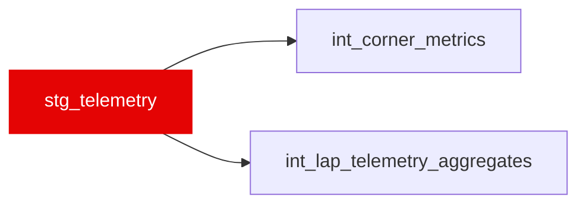

{/* _AUTOGENERATED   do not hand-edit. Run `python scripts/gen_dbt_reference.py` to regenerate. */}

<Note>Part of the [Staging](/transform/families/staging) family.</Note>

High-frequency car telemetry (~10 Hz) from FastF1, one row per sample. Renames Bronze channels to snake_case and projects the powertrain channels (rpm, n_gear, drs_active) consumed by int_lap_telemetry_aggregates. Samples are filtered to 0 &lt; distance_m &lt; 6500. DRS decode: FastF1 codes 10/12/14 = active → drs_active = TRUE.

## Lineage

## Overview

| Property | Value |
|---|---|
| Layer | `staging` |
| Family | [Staging](/transform/families/staging) |
| Contract enforced | No |

**0 tests** [guard](/transform/ci/overview) this model  -  0 generic, 0 singular.

## Columns

| Column | Type | Nullable | Tests | Description |
|---|---|---|---|---|
| `telemetry_id` | `varchar` | Yes |   | Composite key   &#123;season&#125;_&#123;race_id&#125;_&#123;driver_id&#125;_&#123;lap_number&#125; (not unique; many samples per lap). |
| `race_year` | `integer` | Yes |   | Season year. |
| `race_id` | `varchar` | Yes |   | Numeric FastF1 event id cast to string. |
| `driver_id` | `varchar` | Yes |   | FastF1 three-letter driver code. |
| `lap_number` | `integer` | Yes |   | Lap index the sample belongs to. |
| `distance_m` | `double` | Yes |   | Distance along the lap from start/finish (m); samples filtered to 0–6500 m. |
| `speed_kph` | `double` | Yes |   | Instantaneous car speed (kph). |
| `throttle_pct` | `double` | Yes |   | Throttle application (0–100%). |
| `brake_applied` | `boolean` | Yes |   | TRUE when the brake pedal was applied at the sample. |
| `rpm` | `double` | Yes |   | Engine speed (revolutions per minute). |
| `n_gear` | `integer` | Yes |   | Selected gear (0 = neutral). |
| `drs_active` | `boolean` | Yes |   | TRUE when DRS was open/active (FastF1 codes 10/12/14). |
| `source_channel` | `varchar` | Yes |   | FastF1 sample provenance ('car' = true channel cadence; 'pos'/'interpolation' = forward-filled). |
