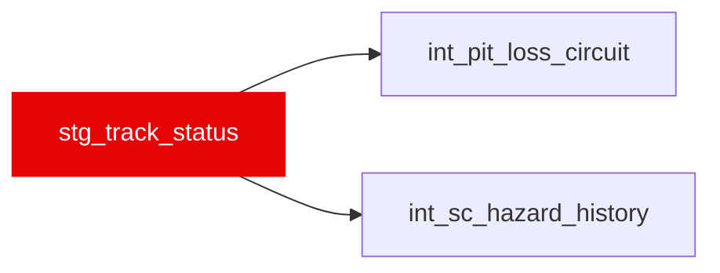

{/* _AUTOGENERATED   do not hand-edit. Run `python scripts/gen_dbt_reference.py` to regenerate. */}

<Note>Part of the [Staging](/transform/families/staging) family.</Note>

SC/VSC/yellow/red timeline from FastF1 session.track_status. One row per status-change event, ordered within each race by session_time_s, with a named decode and a per-event duration. Decode is ground-truthed against the Message column: 4 = SC, 5 = Red, 6 = VSC, 7 = VSC-ending (this corrects the stale mapping in stg_laps). Feeds int_pit_loss_circuit and int_sc_hazard_history.

## Lineage

## Overview

| Property | Value |
|---|---|
| Layer | `staging` |
| Family | [Staging](/transform/families/staging) |
| Contract enforced | No |

**5 tests** [guard](/transform/ci/overview) this model  -  4 generic, 1 singular.

## Columns

| Column | Type | Nullable | Tests | Description |
|---|---|---|---|---|
| `track_status_id` | `varchar` | Yes | [`not_null`](/transform/ci/structural) | Surrogate key   &#123;race_id&#125;_&#123;session_time_s&#125;. |
| `race_year` | `integer` | Yes |   | Season year. |
| `race_id` | `varchar` | Yes | [`not_null`](/transform/ci/structural) | Numeric FastF1 event id cast to string; matches stg_laps.race_id. |
| `race_slug` | `varchar` | Yes |   | Human-readable event name. |
| `session_time_s` | `double` | Yes | [`not_null`](/transform/ci/structural) | Session clock (s) at which the status changed. |
| `status_code` | `varchar` | Yes |   | Raw FastF1 numeric status code as a string. |
| `status_message` | `varchar` | Yes |   | Raw FastF1 status message (e.g. 'SCDeployed', 'VSCDeployed'). |
| `status_label` | `varchar` | Yes | [`accepted_values`](/transform/ci/range-and-domain) | Named decode of the status code. |
| `is_safety_car` | `boolean` | Yes |   | TRUE when status_code = 4 (full Safety Car). |
| `is_vsc` | `boolean` | Yes |   | TRUE when status_code is 6 or 7 (Virtual Safety Car deployed/ending). |
| `is_red_flag` | `boolean` | Yes |   | TRUE when status_code = 5 (red flag). |
| `status_duration_s` | `double` | Yes |   | Seconds this status was in effect (until the next change in the race); NULL for the final open-ended event. |
