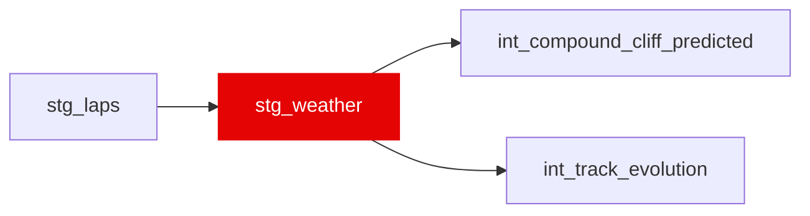

{/* _AUTOGENERATED   do not hand-edit. Run `python scripts/gen_dbt_reference.py` to regenerate. */}

<Note>Part of the [Staging](/transform/families/staging) family.</Note>

Weather snapshot nearest each lap start. Bronze weather samples (≈1 Hz) are matched to laps with ASOF semantics: for each lap, the sample with the largest session_time_s that is still ≤ lap_start_time_s (conditions as the lap begins), falling back to the first sample for laps starting before the first reading. One row per driver × lap; covers all races 2018–2024 with zero source nulls.

## Lineage

## Overview

| Property | Value |
|---|---|
| Layer | `staging` |
| Family | [Staging](/transform/families/staging) |
| Contract enforced | No |
| Upstream | [`stg_laps`](./stg_laps) |

**1 tests** [guard](/transform/ci/overview) this model  -  0 generic, 1 singular.

## Columns

| Column | Type | Nullable | Tests | Description |
|---|---|---|---|---|
| `lap_id` | `varchar` | Yes |   | Foreign key to stg_laps. |
| `race_year` | `integer` | Yes |   | Season year. |
| `race_id` | `varchar` | Yes |   | Numeric FastF1 event id cast to string. |
| `driver_id` | `varchar` | Yes |   | FastF1 three-letter driver code. |
| `lap_number` | `integer` | Yes |   | Lap index within the race. |
| `weather_session_time_s` | `double` | Yes |   | Session clock (s) of the matched weather sample. |
| `ambient_temp_c` | `double` | Yes |   | Air temperature (°C). |
| `track_temp_c` | `double` | Yes |   | Track-surface temperature (°C). |
| `rainfall_flag` | `boolean` | Yes |   | TRUE when rainfall was detected at the sample. |
| `humidity_pct` | `double` | Yes |   | Relative humidity (%). |
| `wind_speed_ms` | `double` | Yes |   | Wind speed (m/s). |
| `wind_direction` | `integer` | Yes |   | Wind direction (degrees, 0–359). |
| `pressure_hpa` | `double` | Yes |   | Station air pressure (hPa). 100% non-null in bronze across 2018–2024; range 778–1024 hPa (the low end is Mexico City's altitude, not a defect). Staged for contract completeness — air density derived from it was measured as a degradation feature and rejected as inside harness noise. |
