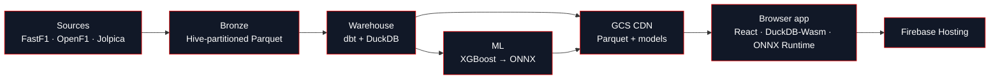

The architecture diagram shows up on a few pages, but the *rationale* and each component's responsibility have not been consolidated anywhere. This is that page: the whole system, end to end, with the design decisions stated next to the boxes they explain.

## What each component is responsible for

| Component | Responsibility | One-line contract |
|---|---|---|
| **Sources** | FastF1 / OpenF1 timing and telemetry; Jolpica reference standings and pit stops | Public APIs, no credentials, politeness contract |
| **Bronze** | Store source data exactly as returned, Hive-partitioned by season and race | Renames to `snake_case`, computes nothing |
| **Warehouse** | Decompose every lap into seven physics terms plus a driver-skill residual | Every model a single `SELECT`; the additive identity holds in CI |
| **ML** | Predict next-lap pace loss, cliff proximity, and remaining stint life | Trains on warehouse marts; exports to ONNX with parity tested |
| **GCS CDN** | Serve the gold Parquet marts and ONNX models as static, cache-busted files | Versioned URLs; no compute |
| **Browser app** | Query Parquet with DuckDB-Wasm and score ONNX in-browser; render charts | Nothing touches a backend at request time |
| **Firebase** | Static hosting for the React bundle | Ships code; data comes from the CDN |

## The medallion mapping, stated explicitly

The warehouse is a textbook medallion architecture, and the folder names are the layers:

- `transform/models/staging/` = **bronze** view onto the raw Parquet (typing, renaming, light cleaning).
- `transform/models/intermediate/` = **silver**: the physics, the skill model, the strategy features, each a tested building block.
- `transform/models/marts/` = **gold**: the wide feature tables and fact tables the app and ML layer consume.

See [Transform layer overview](/transform/overview) for the eight families inside those tiers and the [Model Reference](/reference/models/fct/fct_lap_residuals) for column-level documentation.

## The defining decision: build-time and request-time are separated

Almost every other shape this project could take would put a database and an inference server behind an API. Off The Pace deliberately does not. The heavy compute happens in two places that are *not* the request path:

- **Build time (CI):** ingestion, the entire dbt warehouse, model training, ONNX export, and every drift gate run in GitHub Actions. The output is a set of static Parquet and ONNX files published to a CDN.
- **Request time (client):** the browser downloads those files once and runs DuckDB-Wasm and ONNX Runtime Web locally. Every query and every inference happens on the user's machine.

What this buys, and what it costs:

<CardGroup cols={2}>
  <Card title="What it buys" icon="circle-check">
    Zero per-user serving cost, no backend to operate or scale, offline-capable analytics, and a build pipeline where correctness is gated before anything ships.
  </Card>
  <Card title="What it costs" icon="circle-alert">
    A larger one-time download, no row-level authorization, and a data freshness bounded by the publish cadence rather than live streaming.
  </Card>
</CardGroup>

<Note>This is a trade we made on purpose, not a limitation we backed into. For a use case that is read-only, public, and analytical, pushing compute to the client is the cheapest correct answer. A use case needing per-user data or real-time writes would choose differently.</Note>

## The "why" companions

- **[Architecture decisions](/platform/architecture-decisions)** records each choice as an ADR, including ADR-002 (client-side analytics), ADR-003 (CDN Parquet over an active warehouse), and ADR-010 (version-stamped cache-busting so a data change is never masked by a stale cache).
- **[The project lineage graph](/project-graph.html)** is the live, generated DAG of every model and its dependencies, the same view dbt builds the warehouse from.

## Where to go next

<CardGroup cols={3}>
  <Card title="How it clears a production bar" icon="check-double" href="/data-engineering">
    Contracts, drift gates, lineage, orchestration, and SLOs as standards met.
  </Card>
  <Card title="Engineering highlights" icon="sparkles" href="/engineering-highlights">
    The eight things a reviewer should notice first.
  </Card>
  <Card title="The data pipeline" icon="workflow" href="/platform/data-pipeline">
    The staged orchestration DAG, retries, and post-publish verify.
  </Card>
</CardGroup>
