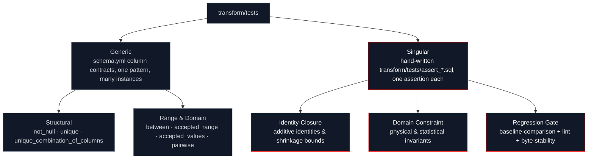

import TransformInventory from '/snippets/transform-inventory.mdx';

A model's SQL states what it computes. The test suite is what lets you trust it. Every transform model ships with its proof: a `schema.yml`-declared column contract, a hand-written assertion in `transform/tests/`, or both and dbt runs all of them on every build. A test **passes when it returns zero rows**; `dbt test` fails the moment a single row violates a contract, so an empty result is the success case, not an absence of output.

The suite splits sharply in shape, and that split drives how this group is organised:

Generic tests are mechanical: one dbt or `dbt_expectations` pattern, declared once per column, repeated across hundreds of columns. They're clubbed into two pages, one explanation each, with a gated table carrying the per-model breakdown. Singular tests are hand-written SQL, each encoding one specific idea a closure, a monotonicity argument, a probability bound so each gets its own explained block rather than being clubbed.

<Info>
  **Zero rows means pass.** Every test in this suite, generic or singular, is a `SELECT` that returns the rows which *violate* a contract. CI doesn't read a boolean; it reads a row count. A model that can't produce a single offending row, across every lap of every race in the warehouse, is the thing being proven.
</Info>

<TransformInventory />

## The three test states

Not every test enforces something on every build. Each one carries a state, read directly off the dbt tree rather than asserted:

<AccordionGroup>
  <Accordion title="Active">
    Runs real logic that can fail the build today. The overwhelming majority of both generic and singular tests are in this state.
  </Accordion>
  <Accordion title="Inert">
    Real logic is present, but it's conditioned on an external baseline snapshot that isn't committed to the repository in a fresh checkout the test detects the snapshot is absent and passes vacuously rather than hard-erroring the build. Both [Regression Gate](/transform/ci/regression-gates) tests are in this state today.
  </Accordion>
  <Accordion title="Placeholder">
    Literally `SELECT 1 WHERE FALSE` wired up once an upstream model (or its confidence intervals) lands, tagged `placeholder` so it can't be mistaken for active coverage. `dbt test --exclude tag:placeholder` runs only the tests that can currently fail, which is the honest measure of how much of the suite is load-bearing right now.
  </Accordion>
</AccordionGroup>

## The five pages

<CardGroup cols={3}>
  <Card title="Structural" icon="key" href="/transform/ci/structural">
    Grain and completeness: every model's declared key is present and non-duplicated.
  </Card>
  <Card title="Range & Domain" icon="ruler" href="/transform/ci/range-and-domain">
    Physical plausibility, enum integrity, and cross-column monotonicity.
  </Card>
  <Card title="Identity-Closure" icon="equal" href="/transform/ci/identity-closure">
    The additive identities themselves, closing to tolerance the most important guarantee in the project.
  </Card>
  <Card title="Domain Constraints" icon="shield-alert" href="/transform/ci/domain-constraints">
    Stint resets, leakage guards, shrinkage bounds, and probability sanity on the singular tests that aren't pure closures.
  </Card>
  <Card title="Regression Gates" icon="history" href="/transform/ci/regression-gates">
    Baseline-comparison gates, the sqlfluff lint contract, and the byte-stability oracle.
  </Card>
</CardGroup>
