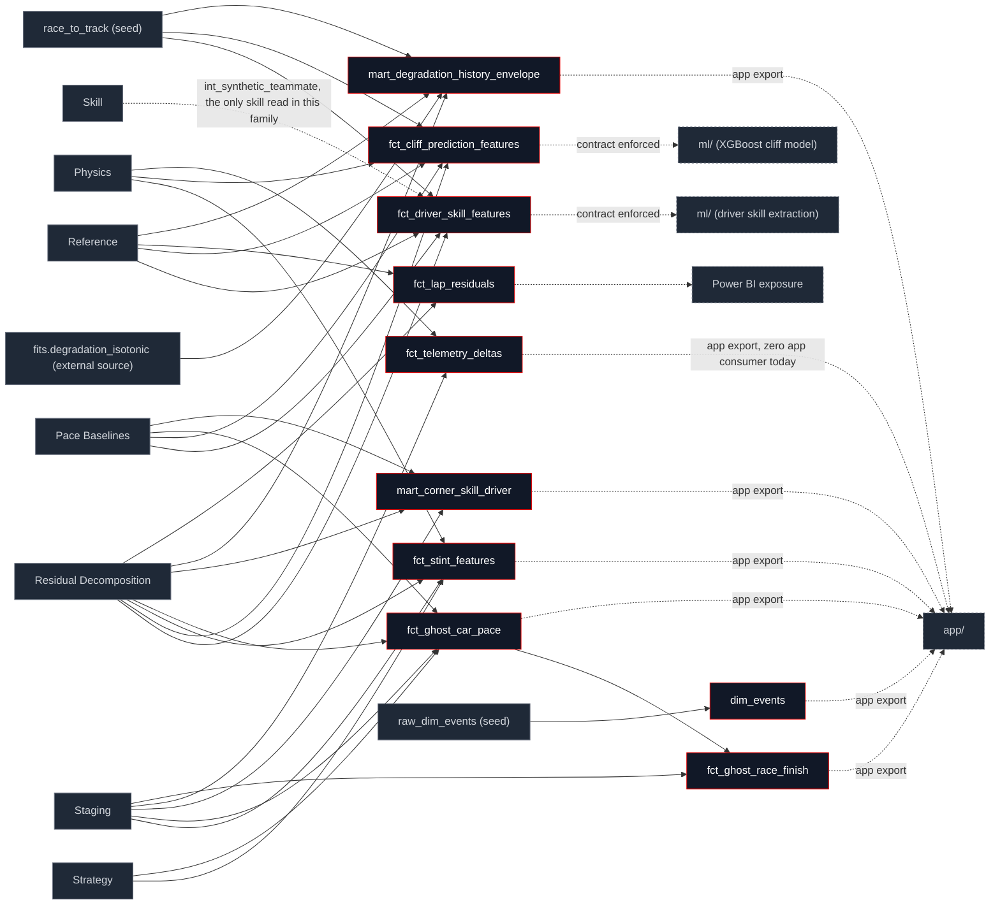

## What this family does

Marts is where the pipeline stops being intermediate and becomes a deliverable. Every other family computes a physics term, a skill estimate, or a strategy counterfactual that something else still has to consume; the ten models here are the consumption points one row per (driver, race), (lap), (stint), or (circuit, era, compound, tyre-age) cell, shaped for a specific reader: the offline ML scoring pipeline, the in-browser app, or a BI dashboard.

Upstream is not one family but effectively all of them confirmed model-by-model against `manifest.json`, not assumed from a generic "all upstream" summary: every mart reads at least one Residual Decomposition model (eight of the ten read `int_lap_residual_decomposed` directly), six read Physics, four read Pace Baselines, two read Strategy, one (`fct_driver_skill_features`) reads Skill via `int_synthetic_teammate`, and three read Staging or a seed directly with no decomposition in between (`fct_telemetry_deltas`, `dim_events`, the two circuit-grain joins inside `mart_corner_skill_driver` and `mart_degradation_history_envelope`). Downstream is `ml/` (two contract-enforced feature tables), `app/` (all ten models are exported to `app/public/data/`, confirmed against `scripts/export_app_data.py` see the note below), and one Power BI exposure reading `fct_lap_residuals` directly.

**This is the other direction of a fact Pace Baselines and Skill already documented**: it's tempting to describe marts as *the* boundary where this layer hands off to `ml/` and `app/`, but [Pace Baselines](/transform/families/pace-baselines) and [Skill](/transform/families/skill) have both shown that many of their own models export straight to the app with no marts model in between. The reverse is also true and worth stating plainly here: marts is not the *only* export boundary, it's the boundary for the things that need shaping (ML contracts, BI semantics, gold-layer joins) rather than a straight intermediate-table passthrough.

`dim_events` is tagged `meta.family: marts` even though it's prefixed `dim_` and sits in the "Dimensions" nav subgroup of [Model Reference](/reference/models) by prefix convention a deliberate divergence between nav placement and narrative placement, not an inconsistency to fix. It's materialized in `models/marts/` as a race-event flag table (damage, retirement, penalty) joined onto `fct_lap_residuals`, not a seed-backed dimension like `dim_circuits`; its story belongs here.

## The sub-DAG

**Deliberate collapse, flagged here**: with effectively every upstream family feeding this one, naming all ~26 individual upstream models (the way [Residual](/transform/families/residual) and [Strategy](/transform/families/strategy) name theirs) would reproduce the full 60-node global DAG, not a focused sub-DAG. This is the second family page to need the same simplification [Staging](/transform/families/staging) used for `stg_laps`' ~20 downstream consumers collapsed to one node per upstream *family* here, except for the two facts that don't fit the collapse: the single intra-family edge (`fct_ghost_car_pace → fct_ghost_race_finish`, the only mart that reads another mart) and the three non-dbt-model inputs (two seeds, one external per-build fit), drawn individually because they aren't part of any family's narrative.



All ten models are exported to the app, verified against `scripts/export_app_data.py`'s table list, not assumed that's every single mart, not a subset. Cross-checked against the app's own query files (`app/src/features/*/queries.ts` plus the `ghost-car/*` routes and `useRaces` hook, since two consumers don't follow the `queries.ts` convention): nine of the ten power a named feature today. `fct_telemetry_deltas` is exported but, verified by grep, has **zero current app consumer** no `telemetry-style-fingerprint` feature directory exists despite the model's own header naming that as its purpose. Flagged here as a fact about the current tree, the same pattern [Residual](/transform/families/residual) already found for `int_corner_skill_residuals`.

## How it works

Two models carry a dbt model contract; the other eight don't, and the split is deliberate rather than inconsistent:

```yaml
config:
  contract:
    enforced: true
```

`fct_driver_skill_features` and `fct_cliff_prediction_features` are the column-exact inputs to the offline ONNX/XGBoost scoring pipeline in `ml/` a renamed or retyped column there silently breaks scoring parity, so the contract turns that into a hard `dbt build` failure at the source instead of a runtime surprise. Every other mart is an internal analytics or app-feed surface with no cross-system consumer that breaks on a schema change, so none of them carry a contract.

`fct_cliff_prediction_features`'s own header states a leakage constraint as a standing rule, not a one-time check: synthetic-teammate features are deliberately excluded because they causally encode the prediction target, and the model "must never reference `int_synthetic_teammate`" the one upstream model this mart is forbidden from reading, even though its sibling `fct_driver_skill_features` reads it directly.

`mart_degradation_history_envelope` sources `fits.degradation_isotonic` a weighted isotonic fit plus modulation coefficients written by `tasks/coefficients/fit_degradation_isotonic.py` to a gitignored `data/fits/` parquet the same external-source pattern [Skill](/transform/families/skill)'s `int_constructor_car_fe` already uses for `fits.constructor_car_fe`: a per-build statistical fit, not a curated CSV seed, because the coefficients are meant to move every time the lap panel does, unlike `dim_compounds_season`'s promoted-to-seed survival fit. The app headline recomposes the fuel-removed envelope with a bounded modulation term:

$$M(k) = \text{clamp}\!\left(1 + a\cdot\mathbb{1}[\text{dirty\_air}] + b\cdot\max(0,\,\Delta T - h),\; 1,\; 1.5\right)$$

$$\text{tyre}(k) = \text{obs\_deg\_from\_fresh\_p50\_mono\_s}(k) \times M(k)$$

where the isotonic base (`obs_deg_from_fresh_p50_mono_s`) is monotone non-decreasing by construction, and the dirty-air multiplier `a` is sign-and-significance gated it falls back to no effect (`1.0`) on any cell where the within-race contrast isn't both positive and significant, rather than ever applying a spurious negative penalty.

`mart_corner_skill_driver` reuses the leave-one-race-out car-baseline pattern Skill's `int_driver_race_skill_loro` established, applied here to corner-phase residuals instead of lap pace the car's corner effect at each driver-race-corner cell is the mean residual of the *other* same-car drivers, computed as a sum-minus-self rather than a second aggregation pass:

```sql
(ca.sum_braking_s - COALESCE(dca.driver_sum_braking_s, 0))
/ NULLIF(ca.n_braking - dca.n_braking, 0) AS loro_braking_s
```

`fct_ghost_race_finish` propagates every coefficient uncertainty already carried in `fct_ghost_car_pace` (host structural-pace SE, host/ego deg-slope posterior SDs, host/ego cliff-shift SEs) into a per-driver predicted-mean-pace variance, then turns pairwise pace gaps into order probabilities under a normal approximation, via the shared `normal_cdf` macro:

```sql
{{ normal_cdf('(mu_j - mu_i) / sd_diff') }} AS p_i_beats_j
```

$$\text{finish\_pos\_se} = \sqrt{\sum_k p_k(1-p_k)}$$

the Poisson-binomial standard deviation of how many drivers are predicted ahead closed-form, not simulated.

<Steps>
  <Step title="Wide analytics first">
    `fct_lap_residuals` exposes the full closed identity at lap grain, unfiltered, for analytics and the Power BI exposure every other ML-facing mart is a narrower, purpose-built derivative of the same upstream residual.
  </Step>
  <Step title="Split ML feature tables">
    `fct_driver_skill_features` (race grain) and `fct_cliff_prediction_features` (lap grain) are deliberately separate, contract-enforced, and column-disjoint on anything that could leak a label.
  </Step>
  <Step title="Strategy and specialty marts">
    `fct_stint_features` (pit-strategy grain), `mart_corner_skill_driver` (driver-season corner skill), `mart_degradation_history_envelope` (the Degradation Simulator's history overlay), and `fct_telemetry_deltas` (teammate corner deltas) each serve one named consumer.
  </Step>
  <Step title="Counterfactual recombination last">
    `fct_ghost_car_pace` recombines ego skill with host car pace at lap grain; `fct_ghost_race_finish` is the only model in this family that reads another mart, ranking those recombined laps by mean pace into a projected finishing order with propagated SEs.
  </Step>
</Steps>

## Design notes

<Tabs>
  <Tab title="Why this shape">
    Contracts are applied narrowly, not as a default. The two ML-bound marts get one because a silent column rename there breaks an offline scoring pipeline with no compile-time signal; every other mart's schema can evolve alongside the analysis it serves, since nothing outside this dbt project depends on its exact shape today. Promoting a mart to a contract is a one-time decision made *when* it gains a real external consumer, not pre-emptively for marts that might someday have one.

    `fct_lap_residuals` is the one deliberately wide mart; `fct_driver_skill_features` and `fct_cliff_prediction_features` are deliberately narrow and split from each other, not from a shared base table. The split exists specifically to keep label-adjacent features (synthetic-teammate deltas) out of the lap-grain predictive mart entirely, rather than relying on the training script to remember which columns to drop.

    The ghost-car SE propagation is closed-form (a normal approximation through `normal_cdf`) rather than simulated, matching the same "named assumption, no hidden randomness" preference [Strategy](/transform/families/strategy) already states for its own deterministic pit-lap counterfactual every variance term it sums is itself an already-fitted posterior SE or SD from an upstream model, not a fresh assumption introduced here.
  </Tab>
  <Tab title="Other approaches">
    A single wide feature mart (one table, all downstream consumers project the columns they need) is the credible alternative to today's `fct_lap_residuals` / `fct_driver_skill_features` / `fct_cliff_prediction_features` split. It would mean one fewer model to keep in sync, at the cost of the leakage boundary becoming a documentation convention instead of a model that structurally excludes `int_synthetic_teammate`.

    A Monte Carlo roll-forward over the same coefficient uncertainties is the credible alternative to `fct_ghost_race_finish`'s closed-form `normal_cdf` SE propagation and unlike most "other approaches" named on these family pages, one already exists as a standalone script (`scripts/mc_finish_order.py`), kept outside the dbt build rather than wired into this mart, because a roll-forward simulation suits an offline validation pass better than a per-build, every-PR materialization.

    Promoting `fits.degradation_isotonic` from a per-build external source to a curated seed (the way the cliff-survival fit feeding `dim_compounds_season` was promoted) is the credible alternative to today's regenerate-every-build approach it would trade reproducibility (the fit always reflects the current lap panel) for the same staleness-vs-stability tradeoff [Reference](/transform/families/reference) already names for its own seed-backed dimensions.
  </Tab>
</Tabs>

## Every model in this family

<CardGroup cols={3}>
  <Card title="fct_lap_residuals" icon="table" href="/reference/models/fct/fct_lap_residuals">
    Lap-grain, unfiltered exposure of the full residual decomposition plus anomaly flags the wide analytics table; ML consumers should prefer the split marts below.
  </Card>
  <Card title="fct_driver_skill_features" icon="user-check" href="/reference/models/fct/fct_driver_skill_features">
    Race-grain driver skill features for the driver-skill extraction model. Contract-enforced.
  </Card>
  <Card title="fct_cliff_prediction_features" icon="mountain" href="/reference/models/fct/fct_cliff_prediction_features">
    Lap-grain features plus the detrended degradation-jump target for the tyre-cliff XGBoost model. Contract-enforced; never reads synthetic-teammate features.
  </Card>
  <Card title="fct_stint_features" icon="layers" href="/reference/models/fct/fct_stint_features">
    Stint-grain pit-strategy features: compound, tyre-age progression, thermal buildup, cliff onset lap, end-of-stint pace falloff.
  </Card>
  <Card title="fct_ghost_car_pace" icon="ghost" href="/reference/models/fct/fct_ghost_car_pace">
    Lap-grain counterfactual: ego driver's skill recombined with host constructor's car pace, including deg- and cliff-interaction terms.
  </Card>
  <Card title="fct_ghost_race_finish" icon="flag" href="/reference/models/fct/fct_ghost_race_finish">
    Projected finishing position per (host constructor, ego driver, race), ranked by mean pace with propagated standard errors.
  </Card>
  <Card title="mart_corner_skill_driver" icon="route" href="/reference/models/fct/mart_corner_skill_driver">
    Driver-season corner skill ranking: time-based LORO car-baseline deviation, z-scored across braking, mid-corner, and exit phases.
  </Card>
  <Card title="mart_degradation_history_envelope" icon="chart-line" href="/reference/models/fct/mart_degradation_history_envelope">
    Pre-aggregated historical stint envelope (circuit × era × compound × tyre-life) powering the Degradation Simulator's history overlay.
  </Card>
  <Card title="dim_events" icon="octagon-alert" href="/reference/models/dim/dim_events">
    Race-level event flags (damage, retirement, penalty), joined onto fct_lap_residuals. Tagged marts despite the dim_ prefix see above.
  </Card>
  <Card title="fct_telemetry_deltas" icon="radio" href="/reference/models/fct/fct_telemetry_deltas">
    Teammate-pair corner-metric deltas (braking point, minimum speed, throttle point). Exported to the app; currently has no app consumer.
  </Card>
</CardGroup>
